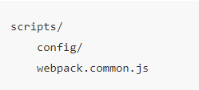

# <center>**webpack**</center>
<article align="left" padding="0 12px">

`npm install webpack webpack-cli -D`

* `webpack` ：这不必多说，其用于编译 JavaScript 模块。
* `webpack-cli` ：此工具用于在命令行中运行 webpack。

建立目录

在 `webpack.common.js` 中
```js
const path = require('path')

module.exports = {
  entry: {
    app: path.resolve(__dirname, '../../src/app.js'),
  },
  output: {
    filename: 'js/[name].[hash:8].js',
    path: path.resolve(__dirname, '../../dist'),
  },
}

```
> webpack 配置是标准的 Node.js 的 CommonJS 模块，它通过 `require` 来引入其他模块，通过 `module.exports` 导出模块，由 webpack 根据对象定义的属性进行解析。

* `entry` ：定义了入口文件路径，其属性名 app 表示引入文件的名字。
* `output` ：定义了编译打包之后的文件名以及所在路径。

入口文件为根目录下scr/app.js
输出文件为根目录下dist

在`package.json`中
```git
  "scripts": {
+   "build": "webpack --config ./scripts/config/webpack.common.js",
  },
```
* `path.resolve` ：node 的官方 api，可以将路径或者路径片段解析成绝对路径。
* `__dirname` ：其总是指向**被执行 js 文件**的绝对路径。
*例如上面的webpack.common.js中指的就是/xxx/xxx/xxx/项目文件夹/scripts/config。所以path.resolve(__dirname, '../../src/app.js')指的是绝对路径:/xxx/xxx/xxx/项目文件夹/src/app.js*

为了方便起见,可以先用个变量存储我们的项目目录根路径和项目名称
```js
// 建立根目录文件constant.js
const path = require('path')

const PROJECT_PATH = path.resolve(__dirname, '../')
const PROJECT_NAME = path.parse(PROJECT_PATH).name

module.exports = { 
  PROJECT_PATH,
  PROJECT_NAME
}
```
* `PROJECT_PATH` ：表示项目的根目录。
* `PROJECT_NAME` ：表示项目名，目前不用，但之后的配置会用到，我们就先定义好吧～

```js
// webpack.common.js 修改如下
const { resolve } = require('path')
const { PROJECT_PATH } = require('../constants')

module.exports = {
  entry: {
    app: resolve(PROJECT_PATH, './src/app.js'),
  },
  output: {
    filename: 'js/[name].[hash:8].js',
    path: resolve(PROJECT_PATH, './dist'),
  },
}
```

#### 区分开发/生产环境
`npm install webpack-merge -D`
script
    config
        webpack.common.js
        webpack.dev.js
        webpack.prod.js

```js
// webpack.dev.js
const { merge } = require('webpack-merge')
const common = require('./webpack.common.js')

module.exports = merge(common, {
  mode: 'development',
})

```
```js
// webpack.prod.js
const { merge } = require('webpack-merge')
const common = require('./webpack.common.js')

module.exports = merge(common, {
  mode: 'production',
})
```
##### 设置环境变量
mac: `export NODE_ENV=development`
windows: `set NODE_ENV=development`

`cross-env` 可跨平台设置和使用环境变量
`npm install cross-env -D`
`package.json`修改:
```git
{
  "scripts": {
+   "start": "cross-env NODE_ENV=development webpack --config ./scripts/config/webpack.dev.js",
+   "build": "cross-env NODE_ENV=production webpack --config ./scripts/config/webpack.prod.js",
-   "build": "webpack --config ./scripts/config/webpack.common.js",
  },
}
```
`constants.js`修改:增加一个公用布尔变量 `isDev`
```git
const path = require('path')

const PROJECT_PATH = path.resolve(__dirname, '../')
const PROJECT_NAME = path.parse(PROJECT_PATH).name

+ const isDev = process.env.NODE_ENV !== 'production'

module.exports = {
    PROJECT_PATH,
    PROJECT_NAME
+   isDev,
}

```
修改`webpack.common.js`:
```git
const { resolve } = require('path')
- const { PROJECT_PATH } = require('../constants')
+ const { isDev, PROJECT_PATH } = require('../constants')

module.exports = {
  entry: {
    app: resolve(PROJECT_PATH, './src/app.js'),
  },
  output: {
-   filename: 'js/[name].[hash:8].js',
+   filename: `js/[name]${isDev ? '' : '.[hash:8]'}.js`,
    path: resolve(PROJECT_PATH, './dist'),
  },
}
```
##### 本地服务启动
`npm install webpack-dev-server html-webpack-plugin -D`
* `html-webpack-plugin` ：每一个页面是一定要有 html 文件的，而这个插件能帮助我们将打包后的 js 文件自动引进 html 文件中，毕竟你不可能每次更改代码后都手动去引入 js 文件。
* `webpack-dev-server` ：可以在本地起一个 http 服务，通过简单的配置还可指定其端口、热更新的开启等。

>plugin 是 webpack 的核心功能，它丰富了 webpack 本身，针对是 loader 结束后，webpack打包的整个过程，它并不直接操作文件，而是基于事件机制工作，会监听 webpack 打包过程中的某些节点，执行广泛的任务。

根目录下新建public文件夹,存放公用静态资源
首先放入`indelx.html`
```html
<!DOCTYPE html>
<html lang="en">
  <head>
    <meta charset="UTF-8" />
    <meta name="viewport" content="width=device-width, initial-scale=1.0" />
    <title>React+Typescript 快速开发脚手架</title>
  </head>
  <body>
    <div id="root"></div>
  </body>
</html>
```
在`webpack.common.js`中引入该插件`html-webpack-plugin`
```git
const { resolve } = require('path')
const { PROJECT_PATH } = require('../constants')
const { isDev, PROJECT_PATH } = require('../constants')
+ const HtmlWebpackPlugin = require('html-webpack-plugin')

module.exports = {
  entry: {
    app: resolve(PROJECT_PATH, './src/app.js'),
  },
  output: {
    filename: 'js/[name].[hash:8].js',
    filename: `js/[name]${isDev ? '' : '.[hash:8]'}.js`,
    path: resolve(PROJECT_PATH, './dist'),
  },
+ plugins: [
+  	new HtmlWebpackPlugin({
+      template: resolve(PROJECT_PATH, './public/index.html'),
+      filename: 'index.html',
+      cache: fale, // 特别重要：防止之后使用v6版本 copy-webpack-plugin 时代码修改一刷新页面为空问题。
+      minify: isDev ? false : {
+        removeAttributeQuotes: true,
+        collapseWhitespace: true,
+        removeComments: true,
+        collapseBooleanAttributes: true,
+        collapseInlineTagWhitespace: true,
+        removeRedundantAttributes: true,
+        removeScriptTypeAttributes: true,
+        removeStyleLinkTypeAttributes: true,
+        minifyCSS: true,
+        minifyJS: true,
+        minifyURLs: true,
+        useShortDoctype: true,
+      },
+    }),
+  ]
}
```
修改`webpack.dev.js`
```git
const { merge } = require('webpack-merge')
const common = require('./webpack.common.js')
+ const { SERVER_HOST, SERVER_PORT } = require('../constants')

module.exports = merge(common, {
  mode: 'development',
+ devServer: {
+    host: SERVER_HOST, // 指定 host，不设置的话默认是 localhost
+    port: SERVER_PORT, // 指定端口，默认是8080
+    stats: 'errors-only', // 终端仅打印 error
+    clientLogLevel: 'silent', // 日志等级
+    compress: true, // 是否启用 gzip 压缩
+    open: true, // 打开默认浏览器
+    hot: true, // 热更新
+  },
})
```
在`constants.js`中添加了服务和端口变量
```git
const path = require('path')

+ const SERVER_HOST = '127.0.0.1'
+ const SERVER_PORT = 9000

const PROJECT_PATH = path.resolve(__dirname, '../')
const PROJECT_NAME = path.parse(PROJECT_PATH).name
const isDev = process.env.NODE_ENV !== 'production'

module.exports = {
+   SERVER_HOST,
+   SERVER_PORT,
    PROJECT_PATH,
    PROJECT_NAME,
    isDev
}
```
修改`package.json`
```git
{
  "scripts": {
+   "start": "cross-env NODE_ENV=development webpack-dev-server --config ./scripts/config/webpack.dev.js",
-   "start": "cross-env NODE_ENV=development webpack --config ./scripts/config/webpack.dev.js",
   "build": "cross-env NODE_ENV=production webpack --config ./scripts/config/webpack.prod.js",
  },
}
```
##### devtool将编译后代码啊映射回原始代码的sourcemap配置
`webpack.dev.js`
```git
module.exports = merge(common, {
  mode: 'development',
+ devtool: 'eval-source-map',
})
```
`webpack.prod.js`
```git
const { merge } = require('webpack-merge')
const common = require('./webpack.common.js')

module.exports = merge(common, {
  mode: 'production',
+ devtool: 'none',
})
```
##### 打包前清理dist目录
`npm install clean-webpack-plugin -D`
>clean-webpack-plugin 插件会自动找到output中的path然后进行删除

修改`webpack.prod.js`:
```git
const { merge } = require('webpack-merge')
const common = require('./webpack.common.js')
+ const { CleanWebpackPlugin } = require('clean-webpack-plugin')

module.exports = {
  mode: 'production',
  devtool: 'none',
  plugins: [
+    new CleanWebpackPlugin(),
  ],
}
```
##### 样式文件处理
> webpack只会编译.js文件,不支持直接处理呀那个是文件,需要借助loader对模块的源代码进行转换。
loader 可以使你在 import 或"加载"模块时预处理文件。
类似于其他构建工具中“任务(task)”,并提供了处理前端构建步骤的强大方法。
loader 可以将文件从不同的语言（如 TypeScript）转换为 JavaScript，
或将内联图像转换为 data URL。
loader 甚至允许你直接在 JavaScript 模块中 import CSS文件

###### loader和plugin的区别:
loader主要是对模块源代码进行转换
plugin是在源代码转换后,webpack打包的过程中插入的钩子事件(基于事件机制,不直接操作文件),作用于打包过程节点执行的任务.

* **css**
`npm install style-loader css-loader -D`
* `css-loader`:解析`.css`的文件，遇到 `@import` 等语句就将相应样式文件引入，计算后生成**css字符串**。
* `style-loader`:处理上述生成的字符串内容,最终解析完的 css 代码的 style 标签，放到 head 标签里。

* `loader` 是有顺序的，webpack 肯定是先将所有 css 模块依赖解析完得到计算结果再创建 style 标签。因此应该把 `style-loader` 放在 `css-loader` 的前面（**webpack loader 的执行顺序是从右到左，即从后往前**）。

修改`webpack.common.js`:
```git
const { resolve } = require('path')
const { PROJECT_PATH } = require('../constants')
const { isDev, PROJECT_PATH } = require('../constants')
const HtmlWebpackPlugin = require('html-webpack-plugin')

module.exports = {
  entry: {
    app: resolve(PROJECT_PATH, './src/app.js'),
  },
  output: {
    filename: 'js/[name].[hash:8].js',
    filename: `js/[name]${isDev ? '' : '.[hash:8]'}.js`,
    path: resolve(PROJECT_PATH, './dist'),
  },
+ module: {
+   rules: [
+     {
+       test: /\.css$/,
+       use: [
+         'style-loader',
+         {
+           loader: 'css-loader',
+           options: {
+             modules: false, // 默认就是 false, 若要开启，可在官网具体查看可配置项
+             sourceMap: isDev, // 开启后与 devtool 设置一致, 开发环境开启，生产环境关闭
+             importLoaders: 0, // 指定在 CSS loader 处理前使用的 laoder 数量
+           },
+         },
+       ],
+     },
+   ]
+ },
plugins: [
  	new HtmlWebpackPlugin({
      template: resolve(PROJECT_PATH, './public/index.html'),
      filename: 'index.html',
      cache: fale, // 特别重要：防止之后使用v6版本 copy-webpack-plugin 时代码修改一刷新页面为空问题。
      minify: isDev ? false : {
        removeAttributeQuotes: true,
        collapseWhitespace: true,
        removeComments: true,
        collapseBooleanAttributes: true,
        collapseInlineTagWhitespace: true,
        removeRedundantAttributes: true,
        removeScriptTypeAttributes: true,
        removeStyleLinkTypeAttributes: true,
        minifyCSS: true,
        minifyJS: true,
        minifyURLs: true,
        useShortDoctype: true,
      },
    }),
  ],
}
```
`test` 字段是匹配规则，针对符合规则的文件进行处理。
`use` 字段有几种写法：

* 可以是一个字符串，假如我们只使用`style-loader`，只需要 `use: 'style-loader' `。
* 可以是一个数组，假如我们不对 `css-loader `做额外配置，只需要` use: ['style-loader', 'css-loader'] `。
* 数组的每一项既可以是字符串也可以是一个对象，当我们需要在`webpack` 的配置文件中对` loader `进行配置，就需要将其编写为一个对象，并且在此对象的 `options` 字段中进行配置。比如我们上面要对 `css-loader` 做配置的写法

* **less**
`npm install less less-loader -D`
>`less-loader`:将 less 语法转换为 css 语法，并转为 .css 文件

修改`webpack.common.js`:
```git
const { resolve } = require('path')
const { PROJECT_PATH } = require('../constants')
const { isDev, PROJECT_PATH } = require('../constants')
const HtmlWebpackPlugin = require('html-webpack-plugin')

module.exports = {
  entry: {
    app: resolve(PROJECT_PATH, './src/app.js'),
  },
  output: {
    filename: 'js/[name].[hash:8].js',
    filename: `js/[name]${isDev ? '' : '.[hash:8]'}.js`,
    path: resolve(PROJECT_PATH, './dist'),
  },
 module: {
   rules: [
     {
       test: /\.css$/,
       use: [
         'style-loader',
         {
           loader: 'css-loader',
           options: {
             modules: false, // 默认就是 false, 若要开启，可在官网具体查看可配置项
             sourceMap: isDev, // 开启后与 devtool 设置一致, 开发环境开启，生产环境关闭
             importLoaders: 0, // 指定在 CSS loader 处理前使用的 laoder 数量
           },
         }
       ],
     },
+     {
+       test: /\.less$/,
+       use: [
+         'style-loader',
+         {
+           loader: 'css-loader',
+           options: {
+             modules: false, // 默认就是 false, 若要开启，可在官网具体查看可配置项
+             sourceMap: isDev, // 开启后与 devtool 设置一致, 开发环境开启，生产环境关闭
+             importLoaders: 0, // 指定在 CSS loader 处理前使用的 laoder 数量
+           },
+         },
+        {
+           loader: 'less-loader',
+           options: {
+             sourceMap: isDev,
+           },
+        },
+       ],
+     },
   ]
 },
plugins: [
  	new HtmlWebpackPlugin({
      template: resolve(PROJECT_PATH, './public/index.html'),
      filename: 'index.html',
      cache: fale, // 特别重要：防止之后使用v6版本 copy-webpack-plugin 时代码修改一刷新页面为空问题。
      minify: isDev ? false : {
        removeAttributeQuotes: true,
        collapseWhitespace: true,
        removeComments: true,
        collapseBooleanAttributes: true,
        collapseInlineTagWhitespace: true,
        removeRedundantAttributes: true,
        removeScriptTypeAttributes: true,
        removeStyleLinkTypeAttributes: true,
        minifyCSS: true,
        minifyJS: true,
        minifyURLs: true,
        useShortDoctype: true,
      },
    }),
  ],
}
```
* **sass**
`npm install node-sass sass-loader -D`
>`sass-loader`: 将 sass 语法转为 css 语法，并转为 .css 文件。
修改`webpack.common.js`:
```git
const { resolve } = require('path')
const { PROJECT_PATH } = require('../constants')
const { isDev, PROJECT_PATH } = require('../constants')
const HtmlWebpackPlugin = require('html-webpack-plugin')

module.exports = {
  entry: {
    app: resolve(PROJECT_PATH, './src/app.js'),
  },
  output: {
    filename: 'js/[name].[hash:8].js',
    filename: `js/[name]${isDev ? '' : '.[hash:8]'}.js`,
    path: resolve(PROJECT_PATH, './dist'),
  },
 module: {
   rules: [
     {
       test: /\.css$/,
       use: [
         'style-loader',
         {
           loader: 'css-loader',
           options: {
             modules: false, // 默认就是 false, 若要开启，可在官网具体查看可配置项
             sourceMap: isDev, // 开启后与 devtool 设置一致, 开发环境开启，生产环境关闭
             importLoaders: 0, // 指定在 CSS loader 处理前使用的 laoder 数量
           },
         }
       ],
     },
     {
       test: /\.less$/,
       use: [
         'style-loader',
         {
           loader: 'css-loader',
           options: {
             modules: false, // 默认就是 false, 若要开启，可在官网具体查看可配置项
             sourceMap: isDev, // 开启后与 devtool 设置一致, 开发环境开启，生产环境关闭
             importLoaders: 0, // 指定在 CSS loader 处理前使用的 laoder 数量
           },
         },
        {
           loader: 'less-loader',
           options: {
             sourceMap: isDev,
           },
        },
       ],
     },
+     {
+       test: /\.sass$/,
+       use: [
+         'style-loader',
+         {
+           loader: 'css-loader',
+           options: {
+             modules: false, // 默认就是 false, 若要开启，可在官网具体查看可配置项
+             sourceMap: isDev, // 开启后与 devtool 设置一致, 开发环境开启，生产环境关闭
+             importLoaders: 0, // 指定在 CSS loader 处理前使用的 laoder 数量
+           },
+         },
+        {
+           loader: 'sass-loader',
+           options: {
+             sourceMap: isDev,
+           },
+        },
+       ],
+     },
   ]
 },
plugins: [
  	new HtmlWebpackPlugin({
      template: resolve(PROJECT_PATH, './public/index.html'),
      filename: 'index.html',
      cache: fale, // 特别重要：防止之后使用v6版本 copy-webpack-plugin 时代码修改一刷新页面为空问题。
      minify: isDev ? false : {
        removeAttributeQuotes: true,
        collapseWhitespace: true,
        removeComments: true,
        collapseBooleanAttributes: true,
        collapseInlineTagWhitespace: true,
        removeRedundantAttributes: true,
        removeScriptTypeAttributes: true,
        removeStyleLinkTypeAttributes: true,
        minifyCSS: true,
        minifyJS: true,
        minifyURLs: true,
        useShortDoctype: true,
      },
    }),
  ],
}
```
* **postcss**
>对css编译的工具,通过各种插件对css进行处理(类似babel对js)

常用插件:
* `postcss-flexbugs-fixes` ：用于修复一些和 flex 布局相关的 bug。
* `postcss-preset-env `：将最新的 CSS 语法转换为目标环境的浏览器能够理解的 CSS 语法，目的是使开发者不用考虑浏览器兼容问题。我们使用 `autoprefixer` 来自动添加浏览器头。
* `postcss-normalize` ：从 browserslist 中自动导入所需要的 normalize.css 内容。
`npm install postcss-loader postcss-flexbugs-fixes postcss-preset-env autoprefixer postcss-normalize -D`
要为之前配置的样式loader中都加一段这个,所以抽象一个函数`getCssLoader`
修改`webpack.common.js`:
```git
const { resolve } = require('path')
const { PROJECT_PATH } = require('../constants')
const { isDev, PROJECT_PATH } = require('../constants')
const HtmlWebpackPlugin = require('html-webpack-plugin')

+ const getCssLoaders = (importLoaders) => [
+   'style-loader',
+   {
+     loader: 'css-loader',
+     options: {
+       modules: false,
+       sourceMap: isDev,
+       importLoaders,
+     },
+   },
+   {
+     loader: 'postcss-loader',
+     options: {
+       ident: 'postcss',
+       plugins: [
+         // 修复一些和 flex 布局相关的 bug
+         require('postcss-flexbugs-fixes'),
+         require('postcss-preset-env')({
+           autoprefixer: {
+             grid: true,
+             flexbox: 'no-2009'
+           },
+           stage: 3,
+         }),
+         require('postcss-normalize'),
+       ],
+       sourceMap: isDev,
+     },
+   },
+ ]


module.exports = {
  entry: {
    app: resolve(PROJECT_PATH, './src/app.js'),
  },
  output: {
    filename: 'js/[name].[hash:8].js',
    filename: `js/[name]${isDev ? '' : '.[hash:8]'}.js`,
    path: resolve(PROJECT_PATH, './dist'),
  },
 module: {
   rules: [
     {
       test: /\.css$/,
-       use: [
-         'style-loader',
-         {
-           loader: 'css-loader',
-           options: {
-             modules: false, // 默认就是 false, 若要开启，可在官网具体查看可配置项
-             sourceMap: isDev, // 开启后与 devtool 设置一致, 开发环境开启，生产环境关闭
-             importLoaders: 0, // 指定在 CSS loader 处理前使用的 laoder 数量
-           },
-         }
-       ],
+       use: getCssLoaders(1),
     },
     {
       test: /\.less$/,
       use: [
-         'style-loader',
-         {
-           loader: 'css-loader',
-           options: {
-             modules: false, // 默认就是 false, 若要开启，可在官网具体查看可配置项
-             sourceMap: isDev, // 开启后与 devtool 设置一致, 开发环境开启，生产环境关闭
-             importLoaders: 0, // 指定在 CSS loader 处理前使用的 laoder 数量
-           },
-         },
+          ...getCssLoaders(2),
        {
           loader: 'less-loader',
           options: {
             sourceMap: isDev,
           },
        },
       ],
     },
     {
       test: /\.sass$/,
       use: [
-         'style-loader',
-         {
-           loader: 'css-loader',
-           options: {
-             modules: false, // 默认就是 false, 若要开启，可在官网具体查看可配置项
-             sourceMap: isDev, // 开启后与 devtool 设置一致, 开发环境开启，生产环境关闭
-             importLoaders: 0, // 指定在 CSS loader 处理前使用的 laoder 数量
-           },
-         },
+        ...getCssLoaders(2),
        {
           loader: 'sass-loader',
           options: {
             sourceMap: isDev,
           },
        },
       ],
     },
   ]
 },
plugins: [
  	new HtmlWebpackPlugin({
      template: resolve(PROJECT_PATH, './public/index.html'),
      filename: 'index.html',
      cache: fale, // 特别重要：防止之后使用v6版本 copy-webpack-plugin 时代码修改一刷新页面为空问题。
      minify: isDev ? false : {
        removeAttributeQuotes: true,
        collapseWhitespace: true,
        removeComments: true,
        collapseBooleanAttributes: true,
        collapseInlineTagWhitespace: true,
        removeRedundantAttributes: true,
        removeScriptTypeAttributes: true,
        removeStyleLinkTypeAttributes: true,
        minifyCSS: true,
        minifyJS: true,
        minifyURLs: true,
        useShortDoctype: true,
      },
    }),
  ]
}
```
修改`package.json`添加`browserlist`指定项目的目标浏览器的范围
```git
{
  "scripts": {
   "start": "cross-env NODE_ENV=development webpack-dev-server --config ./scripts/config/webpack.dev.js",
   "start": "cross-env NODE_ENV=development webpack --config ./scripts/config/webpack.dev.js",
   "build": "cross-env NODE_ENV=production webpack --config ./scripts/config/webpack.prod.js",
  },
+  "browserslist": [
+    ">0.2%",
+    "not dead", 
+    "ie >= 9",
+    "not op_mini all"
+  ]
}
```
* **图片文字**
`npm install file-loader url-loader -D`
>使用 `file-loader` 或者 `url-loader` 来处理本地资源文件，比如图片、字体文件，而 `url-loader` 具有 `file-loader` 所有的功能，还能在图片大小限制范围内打包成 base64 图片插入到 js 文件中

修改`webpack.common.js`:
```git
const { resolve } = require('path')
const { PROJECT_PATH } = require('../constants')
const { isDev, PROJECT_PATH } = require('../constants')
const HtmlWebpackPlugin = require('html-webpack-plugin')

 const getCssLoaders = (importLoaders) => [
   'style-loader',
   {
     loader: 'css-loader',
     options: {
       modules: false,
       sourceMap: isDev,
       importLoaders,
     },
   },
   {
     loader: 'postcss-loader',
     options: {
       ident: 'postcss',
       plugins: [
         // 修复一些和 flex 布局相关的 bug
         require('postcss-flexbugs-fixes'),
         require('postcss-preset-env')({
           autoprefixer: {
             grid: true,
             flexbox: 'no-2009'
           },
           stage: 3,
         }),
         require('postcss-normalize'),
       ],
       sourceMap: isDev,
     },
   },
 ]


module.exports = {
  entry: {
    app: resolve(PROJECT_PATH, './src/app.js'),
  },
  output: {
    filename: 'js/[name].[hash:8].js',
    filename: `js/[name]${isDev ? '' : '.[hash:8]'}.js`,
    path: resolve(PROJECT_PATH, './dist'),
  },
 module: {
   rules: [
     {
       test: /\.css$/,
       use: getCssLoaders(1),
     },
     {
       test: /\.less$/,
       use: [
          ...getCssLoaders(2),
        {
           loader: 'less-loader',
           options: {
             sourceMap: isDev,
           },
        },
       ],
     },
     {
       test: /\.sass$/,
       use: [
        ...getCssLoaders(2),
        {
           loader: 'sass-loader',
           options: {
             sourceMap: isDev,
           },
        },
       ],
     },
+    {
+        test: [/\.bmp$/, /\.gif$/, /\.jpe?g$/, /\.png$/],
+        use: [
+          {
+            loader: 'url-loader',
+            options: {
+              limit: 10 * 1024,
+              name: '[name].[contenthash:8].[ext]',
+              outputPath: 'assets/images',
+            },
+          },
+        ],
+      },
+      {
+       test: /\.(ttf|woff|woff2|eot|otf)$/,
+        use: [
+          {
+            loader: 'url-loader',
+            options: {
+              name: '[name].[contenthash:8].[ext]',
+              outputPath: 'assets/fonts',
+            },
+          },
+        ],
+      }     
   ]
 },
plugins: [
  	new HtmlWebpackPlugin({
      template: resolve(PROJECT_PATH, './public/index.html'),
      filename: 'index.html',
      cache: fale, // 特别重要：防止之后使用v6版本 copy-webpack-plugin 时代码修改一刷新页面为空问题。
      minify: isDev ? false : {
        removeAttributeQuotes: true,
        collapseWhitespace: true,
        removeComments: true,
        collapseBooleanAttributes: true,
        collapseInlineTagWhitespace: true,
        removeRedundantAttributes: true,
        removeScriptTypeAttributes: true,
        removeStyleLinkTypeAttributes: true,
        minifyCSS: true,
        minifyJS: true,
        minifyURLs: true,
        useShortDoctype: true,
      },
    }),
  ]
}
```
* `[name].[contenthash:8].[ext]` 表示输出的文件名为 原来的`文件名.哈希值.后缀` ，有了这个 hash 值，可防止图片更换后导致的缓存问题。
* `outputPath` 是输出到 `dist` 目录下的路径，即图片目录 `dist/assets/images` 以及字体相关目录 `dist/assets/fonts` 下。
* `limit` 表示如果你这个图片文件大于 `10240b` ，即 `10kb` ，那我 `url-loader` 就不用，转而去使用 `file-loader` ，把图片正常打包成一个单独的图片文件到设置的目录下，若是小于了 `10kb` ，就将图片打包成 base64 的图片格式插入到打包之后的文件中，这样做的好处是，减少了 http 请求，但是如果文件过大，js文件也会过大，得不偿失，这是为什么有 `limit` 的原因！

引入的文件在ts下会报错,在 `src/` 下新建以下文件` typings/file.d.ts`:
```ts
declare module '*.svg' {
  const path: string
  export default path
}

declare module '*.bmp' {
  const path: string
  export default path
}

declare module '*.gif' {
  const path: string
  export default path
}

declare module '*.jpg' {
  const path: string
  export default path
}

declare module '*.jpeg' {
  const path: string
  export default path
}

declare module '*.png' {
  const path: string
  export default path
}
```
参考：
https://github.com/magezee/webpack-config
https://juejin.cn/post/6860129883398668296
</article>