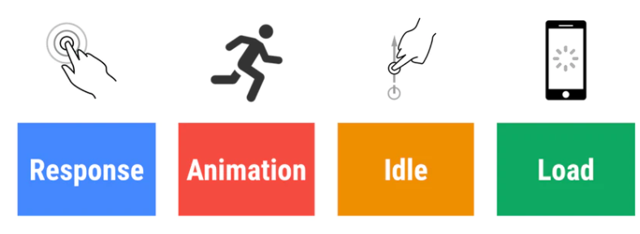

# <center>**前端性能**</center>
<article align="left" padding="0 12px">
在谈论性能时，重要的是做到精确，并且根据能够进行定量测量的客观标准来论及性能。这些标准就是指标。

性能是良好用户体验的基础。一项消费者研究表明，对移动速度延迟的压力反应类似于看恐怖电影或解决数学问题，比在零售店结账时排队等候的压力更大。

当站点发送大量代码时，浏览器必须使用户数以兆字节计的数据计划才能下载代码。移动设备的 CPU 能力和内存有限。他们经常被我们认为是少量未优化的代码所淹没。这会导致性能不佳，从而导致无响应。

以用户为中心的性能模型RAIL，提供了一种考虑性能的结构。该模型将用户体验分解为关键操作（例如，点击、滚动、加载），并帮助您为每个操作定义性能目标。

RAIL 代表 Web 应用程序生命周期的四个不同方面：响应、动画、空闲和加载。


用户对这些有不同的性能期望，因此性能目标是根据用户如何感知延迟的 UX 研究（https://www.nngroup.com/articles/response-times-3-important-limits/） 来定义的。

由以上步骤又可以分为加载性能和渲染性能：

### 一、加载性能
**为什么要提升加载性能：**
1、移动设备流量限制
2、更快的加载速度能提升用户数量，甚至增加购买力，提高转化率
3、加载缓慢不利于搜索引擎优化（SEO），可能会降低网站排名，导致访问量，阅读量和转化子数减少。

**提升加载性能的方式：**
#### a）减少下载大小:

 **1、文字内容**
 1. 缩小代码体积*minification*
通过删除空白和不必要的字符而不改变其有效性或功能来压缩文本资源。如各种框架插件：
a) gulp-html-minifier
b) Tree Shaking（https://developers.google.com/web/fundamentals/performance/optimizing-javascript/tree-shaking?hl=zh-cn）
阻止babel-preset-env将es6转换为commonjs（对tree-shaking来说tree-shaking困难）
设置.bablelrc或package.json
```
{
  "presets": [
    ["env", {
      "modules": false
    }]
  ],
  <!-- 指明特定文件有副作用 -->
  "sideEffects": [
    "./src/utils/utils.js"
  ]
}
```
2. 压缩文本资源*Gzip*
Gzip 是一种用于压缩和解压缩文件的应用程序（及其文件格式）。与单独文件压缩一样，它通过减少资源的大小来减少传送服务器响应所需的时间(https://www.gnu.org/software/gzip/)。   

    与基于桌面或浏览器的本地压缩不同，Gzip 在服务器上工作以识别和处理您指定的某些文件类型。虽然所有现代浏览器都支持 HTTP 请求的 Gzip 压缩，但您必须正确配置服务器以在请求时提供压缩资源。当然，不同的服务器类型有不同的设置要求。例如，您可以通过.htaccess文件配置 Apache 服务器，该文件将包含类似内容。
    ```
    <IfModule deflate_module>
        # Enable compression for the following file types
        AddOutputFilterByType           \
        DEFLATE                        \
        application/javascript        \
        text/css                      \
        text/html                     \
        text/javascript               \
        text/plain                    \
        text/xml
    </IfModule>
    ```
3. 减少依赖的使用
考虑将庞大的库换成一个更小的单一用途函数

 **2、图片内容**
 1. 删除不需要的图像
 2. 选择合适的图像类型：
 PNG（一种 无损压缩格式）比 JPG（一种有损压缩格式）在摄影图像上产生视觉优势 ，但事实质量未必有明显损失
 3. 删除图像元数据
 4. 调整图像大小
 5. 压缩图像

#### b） 减少下载频率
 **3、HTTP请求**
除了仅仅减少下载大小之外，我们还可以考虑减少下载频率。
1. 合并文本资源
例如将所有 CSS（例如）放入主样式表，合并 JavaScript 文件等
2. 结合图形资源
将小图像组合成一个物理图像文件，然后使用 CSS 背景定位仅在页面上的正确位置显示图像的正确部分（通常称为 精灵） 。CSS 重新定位快速且无缝，适用于已下载的资源，并为其他需要的多个 HTTP 请求和图像下载做出了极好的折衷。
例如

    ```
    a.facebook {
    display: inline-block;
    width: 64px; height: 64px;
    background-image: url("socialmediaicons.png");
    background-position: 0px 0px;
    }
    a.twitter {
    display: inline-block;
    width: 64px; height: 64px;
    background-image: url("socialmediaicons.png");
    background-position: -64px 0px;
    }
    a.pinterest {
    display: inline-block;
    width: 64px; height: 64px;
    background-image: url("socialmediaicons.png");
    background-position: -128px 0px;
    }
    ```

3. 警告
服务器请求在 HTTP/2 上速度更快，因此组合文件以消除请求可能不会产生实质性的效果。此外，如果您将相当静态的资源与相当动态的资源结合起来保存请求，您可能会通过强制重新加载资源的静态部分来获取动态部分，从而对您的缓存效率产生不利影响。在这种情况下，HTTP/2 的特性和优势值得探索。

4. JavaScript 位置和内联推送
将脚本引用放在最后，就在结束 body 标记之前。允许浏览器加载和呈现页面内容，然后让它在用户感知初始内容时下载脚本。
获得最大效率而必须加载资源的顺序称为 关键渲染路径(https://bitsofco.de/understanding-the-critical-rendering-path/)
重新定位关键的预渲染脚本的更好解决方案可能是将它们直接放置在页面本身内，称为“内联推送”。
不是将关键脚本放在单独的文件中并在页头中引用它```<script>...</script>```，而是在头部或正文中添加一个块，并插入脚本本身（不是文件引用，而是实际的脚本代码）在需要它的时候。假设脚本不是太大，这个方法将脚本与HTML一起加载并立即执行，并避免将其放入页面头部的额外HTTP请求开销。

预加载资源：https://web.dev/preload-critical-assets/
```
<link rel="preload" as="script" href="critical.js">
<link rel="preload" href="ComicSans.woff2" as="font" type="font/woff2" crossorigin>

<!-- webpack 4.6.0 或更高版本中，它通过在 import()中使用magic comments（魔法注释）支持预加载： -->
import(_/* webpackPreload: true */_ "CriticalChunk")

旧版 webpack，请使用第三方插件，例如 preload-webpack-plugin
```

**4、HTTP缓存**https://web.dev/http-cache/
**启用缓存**
浏览器缓存、代理缓存或内容交付网络 (CDN) 缓存

**缓存头**
1、缓存控制 cache-control 
通常在服务器资源文件中，如Apache的.htacess
```
图像文件类型的缓存设置为与扩展名列表匹配的一个月和公共访问时间
<filesMatch ".(ico|jpg|jpeg|png|gif)$">
 Header set Cache-Control "max-age=2592000, public"
</filesMatch>
样式和脚本（可能比图像更可能更改的资源）的缓存设置为一天和公共访问
<filesMatch ".(css|js)$">
 Header set Cache-Control "max-age=86400, public"
</filesMatch>
```
**no-cache**：有点用词不当，指定可以缓存内容，但如果是这样，则必须在每次请求时重新验证，然后才能将其提供给客户端。这会强制客户端检查新鲜度，但如果资源没有更改，则允许它避免再次下载资源。与无店互斥。

**no-store**：表示内容实际上不能被任何主缓存或中间缓存以任何方式缓存。对于可能包含敏感数据的资源或几乎可以肯定会随着访问而改变的资源，这是一个不错的选择。与no-cache互斥。

**public**：表示内容可以被浏览器和任何中间缓存缓存。覆盖使用 HTTP 身份验证的请求的默认私有设置。与私有互斥。

**private**：指定可以由用户浏览器存储但不能被任何中间缓存缓存的内容。通常用于特定于用户但不是特别敏感的数据。与公众互斥。

**max-age**：定义在必须重新验证或从原始服务器再次下载之前可以缓存内容的最长时间。此选项通常替换 expires 标头（见下文）并以秒为单位取值，最大有效期限为一年（31536000 秒）。

2、过期缓存 expires
置将来内容应该过期的时间
使用更新和更灵活的缓存控制标头，过期标头通常用作后备。
在 Apache 服务器上的文件.htaccess中设置缓存。
```
## EXPIRES CACHING ##
ExpiresActive On
ExpiresByType image/jpg "access plus 1 year"
ExpiresByType image/jpeg "access plus 1 year"
ExpiresByType image/gif "access plus 1 year"
ExpiresByType image/png "access plus 1 year"
ExpiresByType text/css "access plus 1 month"
ExpiresByType application/pdf "access plus 1 month"
ExpiresByType text/x-javascript "access plus 1 month"
ExpiresByType application/x-shockwave-flash "access plus 1 month"
ExpiresByType image/x-icon "access plus 1 year"
ExpiresDefault "access plus 2 days"
## EXPIRES CACHING ##
```


#### 二、渲染性能
现在的网络用户希望他们访问的页面具有交互性并且运行顺畅，这正是您需要投入越来越多时间和精力的地方。页面不仅要快速加载，而且要顺畅地运行；滚动应与手指的滑动一样快，并且动画和交互应如丝绸般顺滑。

要编写高性能的网站和应用，您需要了解浏览器如何处理 HTML、JavaScript 和 CSS，并确保您编写的代码（和您要包括的其他第三方代码）尽可能高效地运行。

**60fps 与设备刷新率**
目前大多数设备的屏幕刷新率为 60 次/秒。因此，如果在页面中有一个动画或渐变效果，或者用户正在滚动页面，那么浏览器渲染动画或页面的每一帧的速率也需要跟设备屏幕的刷新率保持一致。

其中每个帧的预算时间仅比 16 毫秒多一点 (1 秒/ 60 = 16.66 毫秒)。但实际上，浏览器有整理工作要做，因此您的所有工作需要在 10 毫秒内完成。如果无法符合此预算，帧率将下降，并且内容会在屏幕上抖动。 此现象通常称为卡顿，会对用户体验产生负面影响。

 **1、优化JavaScript执行**
* 对于动画效果的实现，避免使用 setTimeout 或 setInterval，请使用 requestAnimationFrame。
* 将长时间运行的 JavaScript 从主线程移到 Web Worker。
* 使用微任务来执行对多个帧的 DOM 更改。
* 使用 Chrome DevTools 的 Timeline 和 JavaScript 分析器来评估 JavaScript 的影响。

1. 使用 requestAnimationFrame 来实现视觉变化

2. 降低复杂性或使用 Web Worker

3. 了解 JavaScript 的“帧税”

4. 避免微优化 JavaScript

 **2、减少样式计算的数量和复杂度**

参考：https://developers.google.com/web/fundamentals/performance/get-started/httprequests-5?hl=zh-cn
</article>