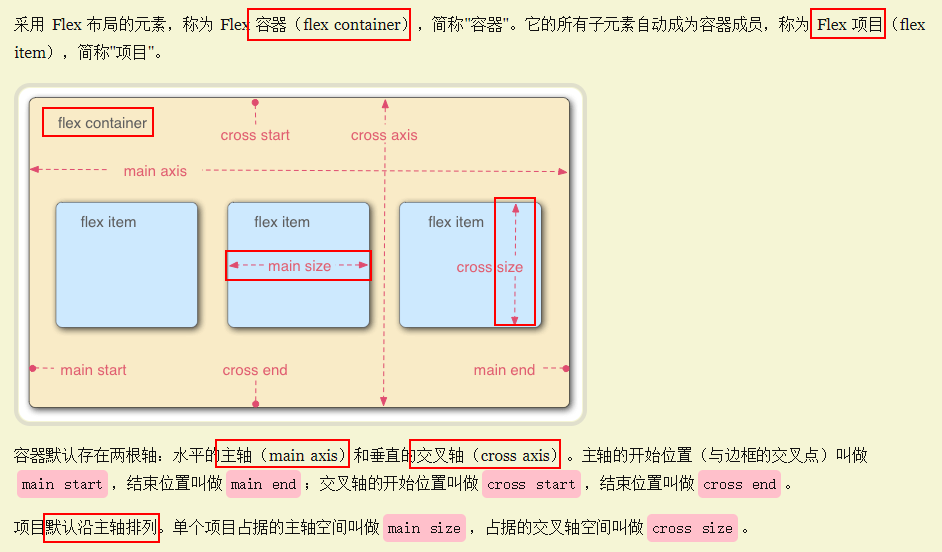

# 
**flex 布局**

<article align="left" padding="0 12px">

### 概念

### 容器属性
*  flex-direction: row | row-reverse | column | column-reverse;
主轴的方向（即项目的排列方向）。

* flex-wrap: nowrap | wrap | wrap-reverse;
如果一条轴线排不下，如何换行。

> flex-flow: flex-direction & flex-wrap;
默认值为row nowrap
 *  justify-content: flex-start | flex-end | center | space-between | space-around;
 项目item在主轴上的对齐方式。

* align-items: flex-start | flex-end | center | baseline | stretch;
项目item在交叉轴上如何对齐。

* align-content: flex-start | flex-end | center | space-between | space-around | stretch;
多根轴线的对齐方式。如果项目只有一根轴线，该属性不起作用。

### 项目属性

* order: integer;
项目的排列顺序。数值越小，排列越靠前，默认为0。  

*  flex-grow: number; /* default 0 */
项目的放大比例，默认为0，即如果存在剩余空间，也不放大。
如果所有项目的flex-grow属性都为1，则它们将等分剩余空间（如果有的话）。如果一个项目的flex-grow属性为2，其他项目都为1，则前者占据的剩余空间将比其他项多一倍。

*  flex-shrink: number; /* default 1 */
项目的缩小比例，默认为1，即如果空间不足，该项目将缩小。
如果所有项目的flex-shrink属性都为1，当空间不足时，都将等比例缩小。如果一个项目的flex-shrink属性为0，其他项目都为1，则空间不足时，前者不缩小。
负值对该属性无效。  

* flex-basis: length | auto; /* default auto */
在分配多余空间之前，项目占据的主轴空间（main size）
默认值为auto，即项目的本来大小。
以设为跟width或height属性一样的值（比如350px）

* flex: [ 'flex-grow' 'flex-shrink' 'flex-basis' ] /* 0 1 auto */
该属性有两个快捷值：auto (1 1 auto) 和 none (0 0 auto)

* align-self: auto | flex-start | flex-end | center | baseline | stretch;
允许单个项目有与其他项目不一样的对齐方式，可覆盖align-items属性。
默认继承父元素，没有stretch
</article>
