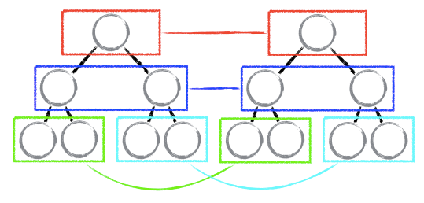
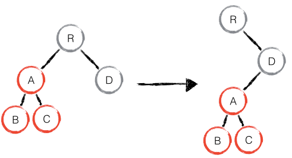
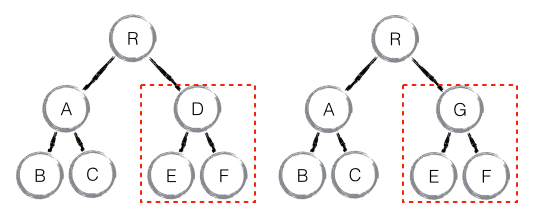
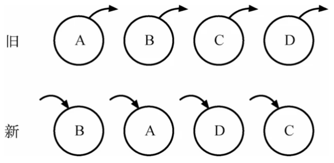
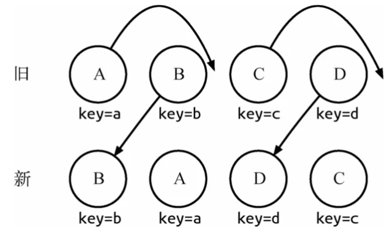
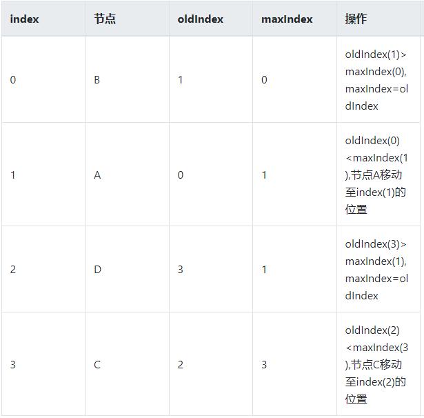
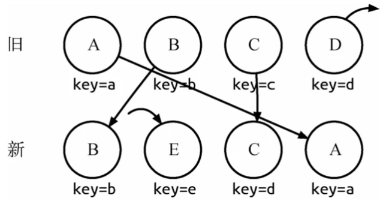
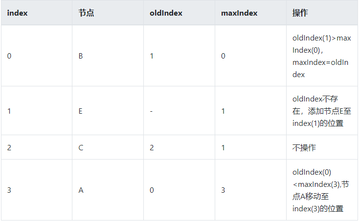
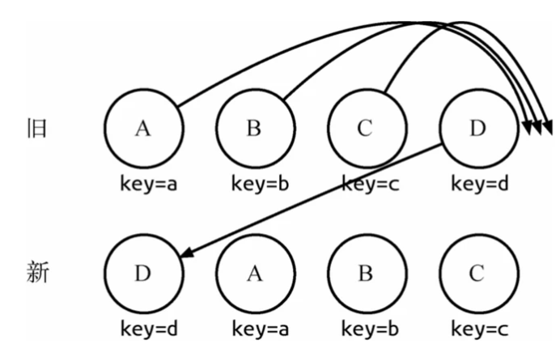

# <center>**React Diff**</center>
<article align="left" padding="0 12px">

#### 前言
React diff 会帮助我们计算出 Virtual DOM 中真正变化的部分，并只针对该部分进行实际 DOM 操作，而非重新渲染整个页面，从而保证了每次操作更新后页面的高效渲染，因此 Virtual DOM 与 diff 是保证 React 性能口碑的幕后推手。

#### 传统 diff 算法
算一棵树形结构转换成另一棵树形结构的最少操作，是一个复杂且值得研究的问题。  

传统 diff 算法通过循环递归对节点进行依次对比，效率低下，算法复杂度达到 O(n^3)，其中 n 是树中节点的总数。O(n^3) 到底有多可怕，这意味着如果要展示1000个节点，就要依次执行上十亿次的比较。这种指数型的性能消耗对于前端渲染场景来说代价太高了！现今的 CPU 每秒钟能执行大约30亿条指令，即便是最高效的实现，也不可能在一秒内计算出差异情况。
> 这是谁用的，有这种？？？？

想要将 diff 思想引入 Virtual DOM，就需要设计一种稳定高效的 diff 算法，而 React 做到了！

那么，React diff 到底是如何实现的呢？

#### 详解 React diff
传统 diff 算法的复杂度为 O(n^3)，显然这是无法满足性能要求的。**React 通过制定大胆的*策略*，将 O(n^3) 复杂度的问题转换成 O(n) 复杂度的问题**。

##### diff 策略
1. Web UI 中 DOM 节点跨层级的移动操作特别少，可以忽略不计。

2. 拥有相同类的两个组件将会生成相似的树形结构，拥有不同类的两个组件将会生成不同的树形结构。

3. 对于同一层级的一组子节点，它们可以通过唯一 id 进行区分。

基于以上三个前提策略，React 分别对 tree diff、component diff 以及 element diff 进行算法优化，事实也证明这三个前提策略是合理且准确的，它保证了整体界面构建的性能。

###### tree diff
基于策略一，React 对树的算法进行了简洁明了的优化，即对树进行分层比较，两棵树只会对同一层次的节点进行比较。

既然 DOM 节点跨层级的移动操作少到可以忽略不计，针对这一现象，React 通过 updateDepth 对 Virtual DOM 树进行层级控制，只会对相同颜色方框内的 DOM 节点进行比较，即同一个父节点下的所有子节点。当发现节点已经不存在，则该节点及其子节点会被完全删除掉，不会用于进一步的比较。这样只需要对树进行一次遍历，便能完成整个 DOM 树的比较。

```
updateChildren: function(nextNestedChildrenElements, transaction, context) {
  updateDepth++;
  var errorThrown = true;
  try {
    this._updateChildren(nextNestedChildrenElements, transaction, context);
    errorThrown = false;
  } finally {
    updateDepth--;
    if (!updateDepth) {
      if (errorThrown) {
        clearQueue();
      } else {
        processQueue();
      }
    }
  }
}
```
分析至此，大部分人可能都存在这样的疑问：**如果出现了 DOM 节点跨层级的移动操作，React diff 会有怎样的表现呢？**
如下图，A 节点（包括其子节点）整个被移动到 D 节点下，由于 React 只会简单的考虑同层级节点的位置变换，而对于不同层级的节点，只有创建和删除操作。当根节点发现子节点中 A 消失了，就会直接销毁 A；当 D 发现多了一个子节点 A，则会创建新的 A（包括子节点）作为其子节点。此时，React diff 的执行情况：**create A -> create B -> create C -> delete A**。

由此可发现，当出现节点跨层级移动时，并不会出现想象中的移动操作，而是以 A 为根节点的树被整个重新创建，这是一种影响 React 性能的操作，因此 **React 官方建议不要进行 DOM 节点跨层级的操作**。

>注意：在开发组件时，保持稳定的 DOM 结构会有助于性能的提升。例如，可以通过 CSS 隐藏或显示节点，而不是真的移除或添加 DOM 节点。



##### component diff
React 是基于组件构建应用的，对于**组件间的比较**所采取的策略也是简洁高效。

* 如果是同一类型的组件，首先使用 shouldComponentUpdate()方法判断是否需要进行比较，如果返回true，继续按照 React diff 策略比较组件的虚拟 DOM 树，否则不需要比较。

* 如果不是，则将该组件判断为 dirty component，从而替换整个组件下的所有子节点。

如下图，当 component D 改变为 component G 时，即使这两个 component 结构相似，一旦 React 判断 D 和 G 是不同类型的组件，就不会比较二者的结构，而是直接删除 component D，重新创建 component G 以及其子节点。虽然当两个 component 是不同类型但结构相似时，React diff 会影响性能，但正如 React 官方博客所言：不同类型的 component 是很少存在相似 DOM tree 的机会，因此这种极端因素很难在实现开发过程中造成重大影响的。



##### element diff
当节点处于**同一层级**时，React diff 提供了三种节点操作，分别为：**INSERT_MARKUP**（插入）、**MOVE_EXISTING**（移动）和 **REMOVE_NODE**（删除）。

* **INSERT_MARKUP** :新的组件类型不在旧集合里，即全新的节点，需要对新节点执行插入操作。
* **MOVE_EXISTING** :旧集合中有新组件类型，且 element 是可更新的类型，generateComponentChildren 已调用receiveComponent ，这种情况下 prevChild=nextChild ，就需要做移动操作，可以复用以前的 DOM 节点。
* **REMOVE_NODE** :旧组件类型，在新集合里也有，但对应的 element 不同则不能直接复用和更新，需要执行删除操作，或者旧组件不在新集合里的，也需要执行删除操作。

旧集合中包含节点A、B、C和D，更新后的新集合中包含节点B、A、D和C，此时新旧集合进行diff差异化对比，发现B!=A，则创建并插入B至新集合，删除旧集合A;以此类推，创建并插入A、D和C，删除B、C和D。

我们发现这些都是相同的节点，仅仅是位置发生了变化，但却需要进行繁杂低效的删除、创建操作，其实只要对这些节点进行位置移动即可。React针对这一现象提出了一种优化策略：**允许开发者对同一层级的同组子节点，添加唯一 key 进行区分**。 虽然只是小小的改动，性能上却发生了翻天覆地的变化!我们再来看一下应用了这个策略之后，react diff是如何操作的。

通过key可以准确地发现新旧集合中的节点都是相同的节点，因此无需进行节点删除和创建，只需要将旧集合中节点的位置进行移动，更新为新集合中节点的位置，此时React 给出的diff结果为:B、D不做任何操作，A、C进行移动操作即可。
具体的流程我们用一张表格来展现一下：


* index： 新集合的遍历下标。
* oldIndex：当前节点在老集合中的下标。
* maxIndex：在新集合访问过的节点中，其在老集合的最大下标值。

操作一栏中只比较oldIndex和maxIndex：

* 当oldIndex>maxIndex时，将oldIndex的值赋值给maxIndex
* 当oldIndex=maxIndex时，不操作
* 当oldIndex<maxIndex时，将当前节点移动到index的位置

上面的例子仅仅是在新旧集合中的节点都是相同的节点的情况下，那如果新集合中有新加入的节点且旧集合存在 需要删除的节点，那么 diff 又是如何对比运作的呢?




>注：最后还需要对**旧集合进行循环遍历**，找出新集合中没有的节点，此时发现存在这样的节点D，因此**删除节点**D，到此 diff 操作全部完成。
同样操作一栏中只比较oldIndex和maxIndex，但是oldIndex可能有不存在的情况：
* oldIndex存在
当oldIndex>maxIndex时，将oldIndex的值赋值给maxIndex
当oldIndex=maxIndex时，不操作
当oldIndex<maxIndex时，将当前节点移动到index的位置
* oldIndex不存在
新增当前节点至index的位置

这种diff并非完美无缺的，我们来看这么一种情况：

实际我们只需对D执行移动操作，然而由于D在旧集合中的位置是最大的，导致其他节点的oldIndex < maxIndex，造成D没有执行移动操作，而是A、B、C全部移动到D节点后面的现象。针对这种情况，官方建议：
>在开发过程中，尽量减少类似将最后一个节点移动到列表首部的操作。当节点数量过大或更新操作过于频繁时，这在一定程度上会影响React的渲染性能。

>虽然加了key提高了diff效率，但是未必一定提升了页面的性能。
对于简单列表页渲染来说，不加key要比加了key的性能更好

总结一下key的作用：
* 准确判断出当前节点是否在旧集合中
* 极大地减少遍历次数

#### 总结
React 通过大胆的假设，制定对应的 diff 策略，将 O(n3) 复杂度的问题转换成 O(n) 复杂度的问题
* 通过分层对比策略，对 tree diff 进行算法优化
* 通过相同类生成相似树形结构，不同类生成不同树形结构以及shouldComponentUpdate策略，对 component diff 进行算法优化
* 通过设置唯一 key 策略，对 element diff 进行算法优化

综上，tree diff 和 component diff 是从顶层设计上降低了算法复杂度，而 element diff 则在在更加细节上做了进一步优化。

</article>