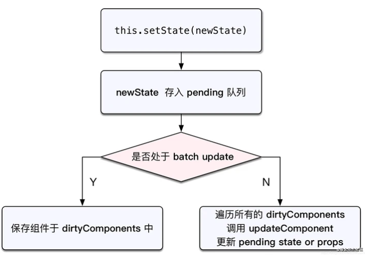
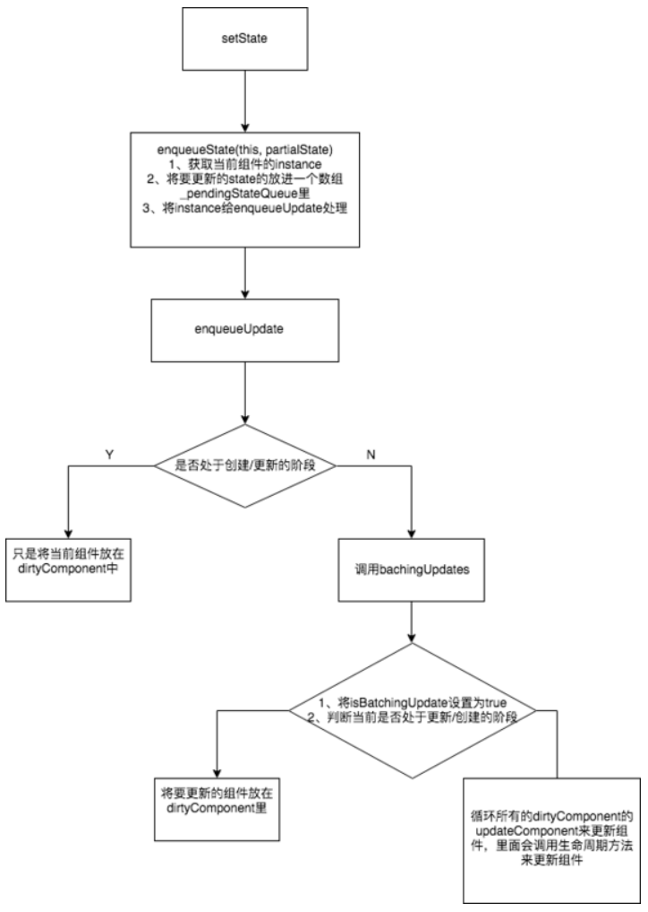
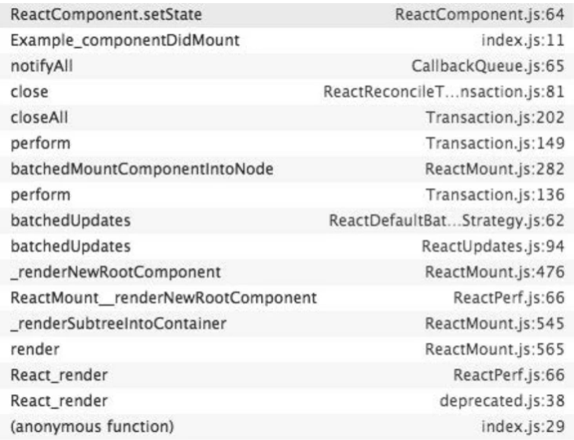
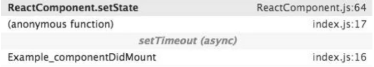

# <center>**React setState**</center>
<article align="left" padding="0 12px">

*针对 React15 版本*
>setState(updater, [callback])

#### 一、setState认知
* setState 不会立刻改变React组件中state的值
* setState 通过触发一次组件的更新来引发重绘
* 多次 setState 函数调用产生的效果会合并

重绘指的就是引起 React 的更新生命周期函数4个函数：
1. shouldComponentUpdate（被调用时this.state没有更新；如果返回了false，生命周期被中断，虽然不调用之后的函数了，但是state仍然会被更新）
2. componentWillUpdate（被调用时this.state没有更新）
3. render（被调用时this.state得到更新）
4. componentDidUpdate

如果每一次 setState 调用都走一圈生命周期，光是想一想也会觉得会带来性能的问题，其实这四个函数都是纯函数，性能应该还好，但是render函数返回的结果会拿去做Virtual DOM比较和更新DOM树，这个就比较费时间。

目前React会将setState的效果放在队列中，积攒着一次引发更新过程。

为的就是把 Virtual DOM 和 DOM 树操作降到最小，用于提高性能。
#### 二、setState经典问题

>结论：在React中，如果是由React引发的事件处理（比如通过onClick引发的事件处理），调用 setState 不会同步更新 this.state，除此之外的setState调用会同步执行this.state。

所谓“除此之外”，指的是绕过React通过 addEventListener 直接添加的事件处理函数，还有通过setTimeout || setInterval 产生的异步调用。

简单一点说， 就是经过React 处理的事件是不会同步更新 this.state的. 通过 addEventListener || setTimeout/setInterval 的方式处理的则会同步更新。
##### 批量更新
```
import React, { Component } from 'react'

class App extends Component {
  state = {
    count: 1,
  }

  handleClick = () => {
    this.setState({
      count: this.state.count + 1,
    })
    console.log(this.state.count) // 1

    this.setState({
      count: this.state.count + 1,
    })
    console.log(this.state.count) // 1

    this.setState({
      count: this.state.count + 1,
    })
    console.log(this.state.count) // 1
  }

  render() {
    return (
      <>
        <button onClick={this.handleClick}>加1</button>
        <div>{this.state.count}</div>
      </>
    )
  }

}

export default App
```
点击按钮触发事件，**打印的都是 1，页面显示 count 的值为 2**。

这就是常常说的 setState 批量更新，对**同一个值**进行多次 **setState** ， setState 的**批量更新策略**会对其进行**覆盖**，取最后一次的执行结果。所以每次 setState 之后立即打印值都是初始值 1(异步)，而最后页面显示的值则为最后一次的执行结果，也就是 2。

但是如果想要达到预期的效果，只需要把setState的参数又object变成更新函数
```
  this.setState((prevState) => {
    return {count: prevState.count + 1}
  });
```
区别在于： 传入一个更新函数，就可以访问当前状态值。 setState调用是 批量处理的，因此可以让更新建立在彼此之上，避免冲突。

##### setTimeout
```
import React, { Component } from 'react'

class App extends Component {
  state = {
    count: 1,
  }

  handleClick = () => {
    this.setState({
      count: this.state.count + 1,
    })
    console.log(this.state.count) // 1

    this.setState({
      count: this.state.count + 1,
    })
    console.log(this.state.count) // 1

    setTimeout(() => {
      this.setState({
        count: this.state.count + 1,
      })
      console.log(this.state.count) // 3
    })
  }
  render() {
    return (
      <>
        <button onClick={this.handleClick}>加1</button>
        <div>{this.state.count}</div>
      </>
    )
  }
}

export default App
```
点击按钮触发事件，发现 setTimeout 里面的 count 值打印值为 3，页面显示 count 的值为 3。setTimeout 里面 setState 之后能马上能到最新值。

**在 setTimeout 里面，setState 是同步的**；经过前面两次的 setState 批量更新，count 值已经更新为 2。在 setTimeout 里面的首先拿到新的 count 值 2，再一次 setState，然后能实时拿到 count 的值为 3。

##### DOM原生事件
```
import React, { Component } from 'react'

class App extends Component {
  state = {
    count: 1,
  }

  componentDidMount() {
    document.getElementById('btn').addEventListener('click', this.handleClick)
  }

  handleClick = () => {
    this.setState({
      count: this.state.count + 1,
    })
    console.log(this.state.count) // 2

    this.setState({
      count: this.state.count + 1,
    })
    console.log(this.state.count) // 3

    this.setState({
      count: this.state.count + 1,
    })
    console.log(this.state.count) // 4
  }

  render() {
    return (
      <>
        <button id='btn'>触发原生事件</button>
        <div>{this.state.count}</div>
      </>
    )
  }
}

export default App
```
点击按钮，会发现每次 setState 打印出来的值都是实时拿到的，不会进行批量更新。

**在 DOM 原生事件里面，setState 也是同步的**。

#### 三、setState 同步异步问题
这里讨论的同步和**异步**并不是指 setState 是否异步执行，使用了什么异步代码，而是指调用 **setState 之后 this.state 能否立即更新**。

React 中的事件都是合成事件，都是由 React 内部封装好的。React 本身执行的过程和代码都是同步的，只是**合成事件和钩子函数的调用顺序在*更新*之前**，导致在合成事件和钩子函数中没法立马拿到更新后的值，就是我们所说的"异步"了。

由上面也可以得知 setState 在原生事件和 setTimeout （更新之后）中都是同步的。

#### 四、setState源码分析
##### 1、setState
源码里面，setState 函数的代码
React 组件继承自React.Component，而 setState 是React.Component的方法
ReactBaseClassses.js
```
ReactComponent.prototype.setState = function (partialState, callback) {
    //  将setState事务放进队列中
  this.updater.enqueueSetState(this, partialState)
  if (callback) {
    this.updater.enqueueCallback(this, callback, 'setState')
  }
}
```
可以看到它直接调用了 this.updater.enqueueSetState 这个方法。
##### 2、enqueueSetState
```
enqueueSetState: function(publicInstance, partialState) {
  // 获取当前组件的instance
  var internalInstance = getInternalInstanceReadyForUpdate(publicInstance,'setState');

  // 将要更新的state放入一个数组里
  var queue = internalInstance._pendingStateQueue || (internalInstance._pendingStateQueue = []);
  queue.push(partialState); 

  // 将要更新的component instance也放在一个队列里
  enqueueUpdate(internalInstance);
}
```
这段代码可以得知，enqueueSetState 做了两件事： 1、将新的state放进数组里 2、用enqueueUpdate来处理将要更新的实例对象

##### 3、enqueueUpdate
接下来看看 enqueueUpdate 做了什么：
ReactUpdates.js
```
function enqueueUpdate(component) {
  // 如果没有处于批量创建/更新组件的阶段，则处理update state事务
  if (!batchingStrategy.isBatchingUpdates) {
    batchingStrategy.batchedUpdates(enqueueUpdate, componentk)
    return
  }

  // 如果正处于批量创建/更新组件的过程，将当前的组件放在dirtyComponents数组中
  dirtyComponents.push(component)
}
```
由这段代码可以看到，当前如果正处于创建/更新组件的过程，就不会立刻去更新组件，而是先把当前的组件放在dirtyComponent里，所以不是每一次的setState都会更新组件~。

enqueueUpdate做的事情：


* 判断组件是否处于批量更新模式，如果是，即isBatchingUpdates为 true 时，不进行 state 的更新操作，而是将需要更新的组件添加到dirtyComponents数组中；
* 如果不是处于批量更新模式，isBatchingUpdates 默认是false，则对所有队列中的更新执行batchedUpdates方法

batchedUpdates函数会把isBatchingUpdates修改为true，而当React在调用事件处理函数**之前**就会调用这个batchedUpdates，造成的后果，就是由React控制的事件处理过程setState不会同步更新this.state。

当中 batchingStrategy该对象的isBatchingUpdates属性直接决定了是马上要走更新流程，还是应该进入队列等待；所以大概可以得知batchingStrategy用于管控批量更新的对象。

##### 4、batchingStrategy
来看看batchingStrategy的源码：
ReactDefaultBatchingStrategy.js
```
var ReactDefaultBatchingStrategy = {
    // 用于标记当前是否出于批量更新,初始值为 false 表示当前并未进行任何批量更新操作
  isBatchingUpdates: false,
  // 当调用这个方法时，正式开始批量更新
  batchedUpdates: function (callback, a, b, c, d, e) {
    var alreadyBatchingUpdates = ReactDefaultBatchingStrategy.isBatchingUpdates

    ReactDefaultBatchingStrategy.isBatchingUpdates = true

    // 如果当前事务正在更新过程在中，则调用callback，既enqueueUpdate
    if (alreadyBatchingUpdates) {
      return callback(a, b, c, d, e)
    } else {
      // 否则执行更新事务
      return transaction.perform(callback, null, a, b, c, d, e)
    }
  },
}
```
这里注意两点： 1、如果当前事务正在更新过程中，则使用enqueueUpdate将当前组件放在dirtyComponent里。 2、如果当前不在更新过程的话，则执行更新事务。

看完批量更新整体的管理机制，发现还有一个操作是transaction.perform，这就引出 React 中的 Transaction（事务）机制。

##### 5、Transaction（事务）机制

在 React 中源码有关于 Transaction 的注释如下：
```
* <pre>
 *                       wrappers (injected at creation time)
 *                                      +        +
 *                                      |        |
 *                    +-----------------|--------|--------------+
 *                    |                 v        |              |
 *                    |      +---------------+   |              |
 *                    |   +--|    wrapper1   |---|----+         |
 *                    |   |  +---------------+   v    |         |
 *                    |   |          +-------------+  |         |
 *                    |   |     +----|   wrapper2  |--------+   |
 *                    |   |     |    +-------------+  |     |   |
 *                    |   |     |                     |     |   |
 *                    |   v     v                     v     v   | wrapper
 *                    | +---+ +---+   +---------+   +---+ +---+ | invariants
 * perform(anyMethod) | |   | |   |   |         |   |   | |   | | maintained
 * +----------------->|-|---|-|---|-->|anyMethod|---|---|-|---|-|-------->
 *                    | |   | |   |   |         |   |   | |   | |
 *                    | |   | |   |   |         |   |   | |   | |
 *                    | |   | |   |   |         |   |   | |   | |
 *                    | +---+ +---+   +---------+   +---+ +---+ |
 *                    |  initialize                    close    |
 *                    +-----------------------------------------+
 * </pre>
```
简单说明一下transaction对象，它暴露了一个perform的方法，用来执行anyMethod，在anyMethod执行的前，需要先执行所有wrapper的initialize方法，在执行完后，要执行所有wrapper的close方法，就辣么简单。

在ReactDefaultBatchingStrategy.js,tranction 的 wrapper有两个 FLUSH_BATCHED_UPDATES, RESET_BATCHED_UPDATES

```
var RESET_BATCHED_UPDATES = {
  initialize: emptyFunction,
  close: function () {
    ReactDefaultBatchingStrategy.isBatchingUpdates = false;
  }
};

var FLUSH_BATCHED_UPDATES = {
  initialize: emptyFunction,
  close: ReactUpdates.flushBatchedUpdates.bind(ReactUpdates)
};

var TRANSACTION_WRAPPERS = [FLUSH_BATCHED_UPDATES, RESET_BATCHED_UPDATES];
```
可以看到，这两个wrapper的initialize都没有做什么事情，但是在callback执行完之后，RESET_BATCHED_UPDATES 的作用是将isBatchingUpdates置为false, FLUSH_BATCHED_UPDATES 的作用是执行flushBatchedUpdates,然后里面会循环所有dirtyComponent,调用updateComponent来执行所有的生命周期方法，componentWillReceiveProps, shouldComponentUpdate, componentWillUpdate, render, componentDidUpdate 最后实现组件的更新。

#### 五、React 钩子函数
都说 React 钩子函数也是异步更新，则必须一开始 isBatchingUpdates 为 ture，但**默认 isBatchingUpdates 为 false**，它是在哪里被设置为 true 的呢？来看下面代码
```
// ReactMount.js
_renderNewRootComponent: function( nextElement, container, shouldReuseMarkup, context ) {
  // 实例化组件
  var componentInstance = instantiateReactComponent(nextElement);
  // 调用 batchedUpdates 方法
  ReactUpdates.batchedUpdates(
    batchedMountComponentIntoNode,
    componentInstance,
    container,
    shouldReuseMarkup,
    context
  );
}
```
这段代码是在首次渲染组件时会执行的一个方法，可以看到它内部调用了一次 batchedUpdates 方法（将 isBatchingUpdates 设为 true），这是因为在组件的渲染过程中，会按照顺序调用各个生命周期(钩子)函数。如果在函数里面调用 setState，则看下列代码：
```
if (!batchingStrategy.isBatchingUpdates) {
  // 立即更新组件
  batchingStrategy.batchedUpdates(enqueueUpdate, component)
  return
}
// 批量更新，则先把组件塞入 dirtyComponents 队列
dirtyComponents.push(component)
```
则所有的更新都能够进入 dirtyComponents 里去，即 setState 走的异步更新
#### 六、React 合成事件
当我们在组件上绑定了事件之后，事件中也有可能会触发 setState。为了确保每一次 setState 都有效，React 同样会在此处手动开启批量更新。看下面代码：
```
// ReactEventListener.js

dispatchEvent: function (topLevelType, nativeEvent) {
  try {
    // 处理事件：batchedUpdates会将 isBatchingUpdates设为true
    ReactUpdates.batchedUpdates(handleTopLevelImpl, bookKeeping);
  } finally {
    TopLevelCallbackBookKeeping.release(bookKeeping);
  }
}
```
isBatchingUpdates 这个变量，在 React 的生命周期函数以及合成事件执行前，已经被 React 改为 true，这时我们所做的 setState 操作自然不会立即生效。当函数执行完毕后，事务的 close 方法会再把 isBatchingUpdates 改为 false。

就像最上面的例子，整个过程模拟大概是：
```
handleClick = () => {
  // isBatchingUpdates = true
  this.setState({
    count: this.state.count + 1,
  })
  console.log(this.state.count) // 1

  this.setState({
    count: this.state.count + 1,
  })
  console.log(this.state.count) // 1

  this.setState({
    count: this.state.count + 1,
  })
  console.log(this.state.count) // 1
  // isBatchingUpdates = false
}
```
而如果有 setTimeout 介入后
```
handleClick = () => {
  // isBatchingUpdates = true
  this.setState({
    count: this.state.count + 1,
  })
  console.log(this.state.count) // 1

  this.setState({
    count: this.state.count + 1,
  })
  console.log(this.state.count) // 1

  setTimeout(() => {
    // setTimeout异步执行，此时 isBatchingUpdates 已经被重置为 false
    this.setState({
      count: this.state.count + 1,
    })
    console.log(this.state.count) // 3
  })
  // isBatchingUpdates = false
}
```
isBatchingUpdates是在同步代码中变化的，而 setTimeout 的逻辑是异步执行的。当 this.setState 调用真正发生的时候，isBatchingUpdates 早已经被重置为 false，这就使得 setTimeout 里面的 setState 具备了立刻发起同步更新的能力。
#### 七、batchedUpdates 方法使用
看到这里大概就可以了解 setState 的同步异步机制了，接下来让我们进一步体会，可以把 React 的batchedUpdates拿来试试，在该版本中此方法名称被置为unstable_batchedUpdates 即不稳定的方法。
```
import React, { Component } from 'react'
import { unstable_batchedUpdates as batchedUpdates } from 'react-dom'

class App extends Component {
  state = {
    count: 1,
  }

  handleClick = () => {
    this.setState({
      count: this.state.count + 1,
    })
    console.log(this.state.count) // 1

    this.setState({
      count: this.state.count + 1,
    })
    console.log(this.state.count) // 1

    setTimeout(() => {
      batchedUpdates(() => {
        this.setState({
          count: this.state.count + 1,
        })
        console.log(this.state.count) // 2
      })
    })
  }
  render() {
    return (
      <>
        <button onClick={this.handleClick}>加1</button>
        <div>{this.state.count}</div>
      </>
    )
  }
}

export default App
```
如果调用batchedUpdates方法，则 isBatchingUpdates变量会被设置为 true，由上述得为 true 走的是批量更新策略，则 setTimeout 里面的方法也变成异步更新了，所以最终打印值为 2。

#### 八、整体流程回顾：
1.enqueueSetState将state放入队列中，并调用enqueueUpdate处理要更新的Component
2.如果组件当前正处于update事务中，则先将Component存入dirtyComponent中。否则调用batchedUpdates处理。
3.batchedUpdates发起一次transaction.perform()事务
4.开始执行事务初始化，运行，结束三个阶段
5.初始化：事务初始化阶段没有注册方法，故无方法要执行
6.运行：执行setSate时传入的callback方法，一般不会传callback参数
7.结束：更新isBatchingUpdates为false，并执行FLUSH_BATCHED_UPDATES这个wrapper中的close方法
8.FLUSH_BATCHED_UPDATES在close阶段，会循环遍历所有的dirtyComponents，调用updateComponent刷新组件，并执行它的pendingCallbacks, 也就是setState中设置的callback。

看完理论， 我们再用一个例子巩固下.
```
class Example extends React.Component {
 constructor() {
   super();
   this.state = {
    val: 0
   };
}
componentDidMount() {
  this.setState({val: this.state.val + 1});
  console.log('第 1 次 log:', this.state.val);
  this.setState({val: this.state.val + 1});
  console.log('第 2 次 log:', this.state.val);

 setTimeout(() => {
  this.setState({val: this.state.val + 1});
  console.log('第 3 次 log:', this.state.val);   
  this.setState({val: this.state.val + 1});
  console.log('第 4 次 log:', this.state.val); 
 }, 0);
}
 render() {
  return null;
 }
};
```
前两次在isBatchingUpdates 中，没有更新state, 输出两个0。

后面两次会同步更新， 分别输出2， 3；

很显然，我们可以将4次setState简单规成两类：
1. componentDidMount是一类
2. setTimeOut中的又是一类，因为这两次在不同的调用栈中执行。

先看看在componentDidMount中setState的调用栈：


再看看在setTimeOut中的调用栈：


我们重点看看在componentDidMount中的sw3e调用栈 ：
发现了batchedUpdates方法。

原来在setState调用之前，就已经处于batchedUpdates执行的事务之中了。

那batchedUpdates方法是谁调用的呢？我们再往上追溯一层，原来是ReactMount.js中的_renderNewRootComponent方法。

也就是说，整个将React组件渲染到DOM的过程就处于一个大的事务中了。

接下来就很容易理解了: 因为在componentDidMount中调用setState时，batchingStrategy的isBatchingUpdates已经被设置为true，所以两次setState的结果并没有立即生效，而是被放进了dirtyComponents中。

这也解释了两次打印this.state.val都是0的原因，因为新的state还没被应用到组件中。

再看setTimeOut中的两次setState，因为没有前置的batchedUpdate调用，所以batchingStrategy的isBatchingUpdates标志位是false，也就导致了新的state马上生效，没有走到dirtyComponents分支。

也就是说，setTimeOut中的第一次执行，setState时，this.state.val为1;

而setState完成后打印时this.state.val变成了2。

第二次的setState同理。

通过上面的例子，我们就知道setState 是可以同步更新的，但是还是尽量避免直接使用， 仅作了解就可以了。

#### 九、总结
setState 同步异步的表现会因调用场景的不同而不同：在 React 钩子函数及合成事件中，它表现为异步；而在 setTimeout/setInterval 函数，DOM 原生事件中，它都表现为同步。这是由 React 事务机制和批量更新机制的工作方式来决定的。

* 不要直接去操作this.state， 这样会造成不必要的性能问题和隐患。
* 由React引发的事件处理，调用setState不会同步更新this.state，除此之外的setState调用会同步执行this.state。

</article>