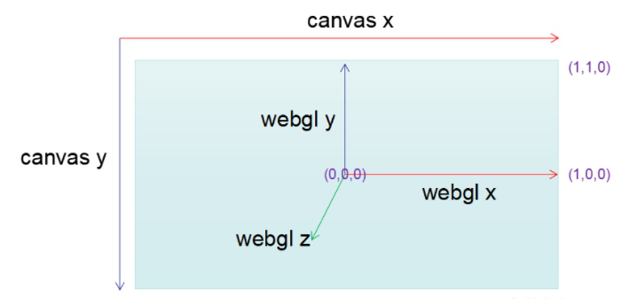
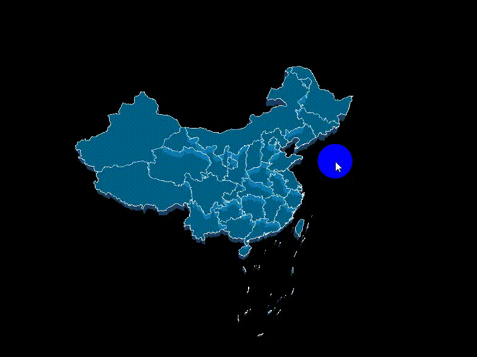

# <center>**threejs实现3D地图信息交互展示**</center>
<article align="left" padding="0 12px">
本文主要介绍在3D引擎——Threejs中如何实现一些常见的交互操作（比如点击、mouseover等）以及通过文中介绍方法实现3D地图信息展示。

在3d的世界中，我们选取一个物体是一个3维的世界，而鼠标所在的屏幕是一个2d的世界。2d的鼠标屏幕点选如何与3d的webgl世界关联起来呢？  

我们有两种方式达到鼠标拾取3d物体的目的，下面首先介绍两种方法及对比两种方法的优劣势，最后再附上一个3d地图的示例。

#### raycast射线拾取
一种是采用几何相交性计算的方式，从鼠标点击的地方，沿着视角方向发射一条射线。通过射线与三维模型的几何相交性判断来决定物体是否被拾取到。 Threejs内置了一个叫做Raycaster的类，为我们提供的是一个射线，然后我们可以根据不同的方向去发射射线，根据射线是否被阻挡，来判断我们是否碰到了物体。我们来看看如何使用Raycaster类来实现鼠标点击物体的高亮显示效果
```
var raycaster = new THREE.Raycaster();   // 实例化Raycaster对象
var mouse = new THREE.Vector2();   // 记录鼠标位置的二维向量
renderer.domElement.addEventListener("mousedown", (event) => {
    mouse.x = (event.clientX / canvasWdith) * 2 - 1;
    mouse.y = -(event.clientY / canvasHeight) * 2 + 1;
    raycaster.setFromCamera(mouse, camera);
    var intersects = raycaster.intersectObjects(cubes, true);
    if (intersects.length > 0) {
        var obj = intersects[0].object;
        obj.material.color.set("#ff0000");
        obj.material.needsUpdate= true;
    }
})
```
当监听dom节点mousedown事件被触发的时候，我们可以在事件回调里面，获取到鼠标在当前dom上的位置（event.clientX、event.clientY）。然后我们需要把canvas坐标系的位置转化为webgl坐标系中的屏幕坐标位置。他们的对应关系如下图所示:


canvas坐标系的原点为左上角，y轴向下。而webgl的屏幕坐标是屏幕中心，y轴向上，且做了归一化处理。所以我们把鼠标的x(event.clientX基于当前canvas的dom的位置)换算到webgl的坐标原点。
```
1.将原点转到屏幕中间即 x - 0.5*CanvasWidth
2.做归一化处理 (x - 0.5*CanvasWidth)/(0.5*CanvasWidth)
即最终 (event.clientX / CanvasWidth) * 2 - 1;
```
y轴计算同理，不过做了一次反转
```
-(event.clientY / CanvasHeight) * 2 + 1;
```
我们继续调用raycaster的方法setFromCamera,可以获得一条和相机朝向一直，从鼠标点射出去的射线。然后就是调用射线与物体相交的检测函数intersectObjects。

 raycaster.intersectObjects(cubes, true)：为了性能，threejs的这个相交测试如果不显示指定第二个参数为true，默认只检测当前级别的物体，子物体不做检测。

#### 基于GPU拾取
除了射线拾取的方式以外，我们还可以采用另外一种图形渲染的方式，来做到拾取。一般做法是给每个mesh一种颜色 然后渲染绘制一遍，在鼠标点所在的位置调用readPixel读取像素颜色，根据颜色与模型的对应关系，反推当前拾取到的颜色对应的mesh。
```
// 点击交互逻辑 
var mouse = new THREE.Vector2();
//初始化一个renderTarget
var pickingTexture = new THREE.WebGLRenderTarget( 1, 1 );
renderer.domElement.addEventListener("mousedown", (event) => {
    mouse.x = event.clientX;
    mouse.y = event.clientY;
    //设置相机为鼠标点的一个像素
    camera.setViewOffset(renderer.domElement.width, renderer.domElement.height, mouse.x * window.devicePixelRatio | 0, mouse.y * window.devicePixelRatio | 0, 1, 1);
    // 设置当前渲染目标对象
    renderer.setRenderTarget(pickingTexture);
    //渲染当前场景
    renderer.render(scene, camera);  
    //恢复相机尺寸
    camera.clearViewOffset();
    //创建 pixelBuffer容器
    var pixelBuffer = new Uint8Array(4);
    //读取颜色信息到pixelBuffer
    renderer.readRenderTargetPixels(pickingTexture, 0, 0, 1, 1, pixelBuffer);
    //获取颜色对应的id
    var id = (pixelBuffer[0] << 16) | (pixelBuffer[1] << 8) | (pixelBuffer[2]);
    if(id>0 &&  scene.getObjectByName("cube"+ id))
    {
        //设置选中颜色
        var obj = scene.getObjectByName("cube"+ id);
        // 修改选择颜色
        obj.material.color.set("#ff0000");
        obj.material.needsUpdate= true; 
    } 
})
```
以上代码主要demo了如何使用threejs进行gpu拾取。这里主要使用了一个WebGLRenderTarget的类，用来将绘制不要直接绘到显示屏幕的buffer中，而是存入了一个“离屏”的缓冲区中。然后我们读取鼠标所在的缓冲区颜色值，从而得到颜色对应的id。这里用了一个方法，将RGB的数据转为数字的方法。
```
var id = (pixelBuffer[0] << 16) | (pixelBuffer[1] << 8) | (pixelBuffer[2]);
```
让不同的材质，然后设置不同的颜色。实际的项目可能比较麻烦。所以也可以尝试使用scene的overrideMaterial方式，全局设置一个材质，然后配合VertexColor的方式设置。

#### 两种方式的比较
**射线拾取:**
*优点：*
使用较为简单，无需额外渲染开销
支持当前射线穿过的所有深度的物体拾取。（比如一个子弹穿墙打人）

*缺点：*
自己实现相交测试的话，几何算法有些难度
使用cpu计算相交性，如果场景较大CPU开销较高，会卡顿（需要额外的八叉树、BVH树优化拾取）

**GPU拾取:**
*优点：*
充分利用GPU运算
由于拾取颜色，自动可以把深度过滤，只取最前面的

*缺点：*
增加了渲染调度的复杂度
增加了渲染的开销

#### 3D地图示例


地图通过**射线拾取**方法交互展示地图信息，核心代码如下：
```
    setRaycaster() {
      this.raycaster = new THREE.Raycaster();
      this.mouse = new THREE.Vector2();
      this.eventOffset = {};
      var _this = this;

      function onMouseMove(event) {
        _this.mouse.x = (event.clientX / _this.width) * 2 - 1;
        _this.mouse.y = -(event.clientY / _this.height) * 2 + 1;
        _this.eventOffset.x = event.clientX;
        _this.eventOffset.y = event.clientY;
        _this.provinceInfo.style.left = _this.eventOffset.x + 2 + 'px';
        _this.provinceInfo.style.top = _this.eventOffset.y + 2 + 'px';
      }

      window.addEventListener('mousemove', onMouseMove, false);

    }

    animate() {
      requestAnimationFrame(this.animate.bind(this));
      this.raycaster.setFromCamera(this.mouse, this.camera);

      var intersects = this.raycaster.intersectObjects(this.scene.children, true);
      if (this.activeInstersect && this.activeInstersect.length > 0) {
        // 将上一次选中的恢复颜色
        this.activeInstersect.forEach(element => {
          element.object.material[0].color.set('#02A1E2');
          element.object.material[1].color.set('#3480C4');
        });
      }

      this.activeInstersect = []; // 设置为空
      
      for (var i = 0; i < intersects.length; i++) {
        if (intersects[i].object.material && intersects[i].object.material.length === 2) {
          this.activeInstersect.push(intersects[i]);
          intersects[i].object.material[0].color.set(0xff0000);
          intersects[i].object.material[1].color.set(0xff0000);
          break; // 只取第一个
        }
      }
      this.createProvinceInfo();

      this.renderer.render(this.scene, this.camera);
    }

    createProvinceInfo() { // 显示省份的信息      
      if (this.activeInstersect.length !== 0 && this.activeInstersect[0].object.parent.properties.name) {
        var properties = this.activeInstersect[0].object.parent.properties;
        this.provinceInfo.textContent = properties.name;
        this.provinceInfo.style.visibility = 'visible';
      } else {
        this.provinceInfo.style.visibility = 'hidden';
      }

    }

```
参考： https://zhuanlan.zhihu.com/p/143642146
</article>