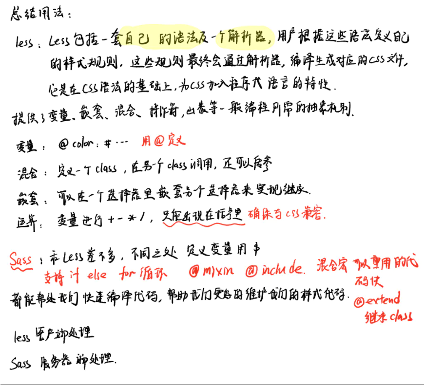
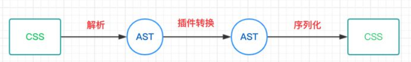
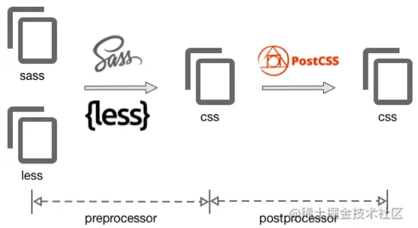

# <center>css</center>
<article align="left" padding="0 12px">

解决css样式隔离的集中方法
* css modules
* css-in-js
* shadow dom

### css BEM 命名规则
>BEM, 即Block__Element--Modifier(.块__元素--修饰符{})
toggle__details--active的类名
这个元素的名称是details, 位置在toggle组件里, 状态为active

### CSS预编译器:Sass、Less、Stylus


### （一）css modules
**CSS modules是使用独特的class名，通过文件名、路径生产独特的hash前缀来隔离各个模块，这个hash是构建工具比如webpack的css-loader插件去生成**

加**局部作用域**和**模块依赖**
http://www.ruanyifeng.com/blog/2016/06/css_modules.html

* css-loader默认的哈希算法是[hash:base64]
* 启用modules可定制哈希类名
```javascript
loaders: [
    // ...
    {
      test: /\.css$/,
      loader: "style-loader!css-loader?modules&localIdentName=[path][name]---[local]---[hash:base64:5]"
    },
  ]
```
css Module中：
* 可以启用全局样式
```javascript
:global(.className){
}
```
* 可以继承组合class
```javascript
.className {
  background-color: blue;
}

.title {
  composes: className/或者+from './another.css';
  color: red;
}
```
* 通过PostCSS 支持变量
```javascript
#colors.css
@value blue: #0c77f8;
@value red: #ff0000;
@value green: #aaf200;

#App.css
@value colors: "./colors.css";
@value blue, red, green from colors;

.title {
  color: red;
  background-color: blue;
}
```

PostCSS 是一种 JavaScript 工具，可将您的 CSS 代码转换为抽象语法树 (AST)，然后提供 API（应用程序编程接口）用于使用 JavaScript 插件对其进行分析和修改。
既不是后处理器也不是预处理器，它只是一个将特殊的PostCSS插件语法转换为 Vanilla CSS 的转译器。




### （二）css-in-js
**CSS in JS中的样式是JS 运行时解析，然后挂载到head**
> 例如：styled-components、Emotion、polished

https://www.ruanyifeng.com/blog/2017/04/css_in_js.html

react的组件结构，注重组件的隔离，没有遵循“关注点分离”（HTML、CSS、JavaScript分离）

但这种“关注点混合”的新写法却逐渐成为主流

表面上是混合在一起，实际是用JavaScript在写html和css

react对html的封装是jsx
react对css的封装简单，即沿用dom的style属性对象
```javascript
const style = {
  'color': 'red',
  'fontSize': '46px'
};

const clickHandler = () => alert('hi'); 

ReactDOM.render(
  <h1 style={style} onclick={clickHandler}>
     Hello, world!
  </h1>,
  document.getElementById('example')
);
```

>许多第三方库来加强css操作————统称为css in js
与预处理器和postcss区别：
CSS in JS 使用 JavaScript 的语法，是 JavaScript 脚本的一部分，不用从头学习一套专用的 API，也不会多一道编译步骤。

API接口设计：CSS prop 与 组件样式

css属性实现思路：
* 解析用户样式，在需要时添加前缀，并将其放入 CSS 类中
* 生成哈希类名
* 利用 CSSOM，创建或更新样式
* 生成新样式时更新 css 节点/规则

emotion四种写法：
1. string + css props 写法
```ts
import { css, jsx } from '@emotion/core'

const color = 'white'

render(
  <div
    css={css`
      padding: 32px;
      background-color: hotpink;
      font-size: 24px;
      border-radius: 4px;
      &:hover {
        background-color: ${color};
      }
    `}
  >
    Hover to change color.
  </div>
)
```

2. object + css props写法
```ts
import { css, jsx } from '@emotion/core'

const color = 'white'

render(
  <div
    css={{
      padding: '32px',
      backgroundColor: 'hotpink',
      fontSize: '24px',
      borderRadius: '4px',
      '&:hover': {
        backgroundColor: color
      }
    }}
  >
    Hover to change color.
  </div>
)
```

3. string + styled 写法
```ts
import styled from '@emotion/styled'

const color = 'white'

const Button = styled.div`
  padding: 32px;
  background-color: hotpink;
  font-size: 24px;
  border-radius: 4px;
  &:hover {
    background-color: ${color};
  }
`

render(<Button>This my button component.</Button>)
```

4. object + styled 写法
```ts
import styled from '@emotion/styled'

const color = 'white'

const Button = styled.div(
    {
        padding: '32px',
        backgroundColor: 'hotpink',
        fontSize: '24px',
        borderRadius: '4px',
        '&:hover': {
          backgroundColor: color
        }
    }
)

render(<Button>This my button component.</Button>)
```
* string写法是纯粹的css样式，而object写法类似于react的style object，但是支持嵌套和selector。
* css props写法可以直接将样式写在组建中，而styled写法是先将组件封装成一个新的组件后再使用。

styled-components 与 emotion 的styled写法一样，需要将组件封装成一个新的组件后再使用。
https://zhuanlan.zhihu.com/p/350324735
**五种 CSS 设计模式**
* OOCSS（Object Oriented CSS）
* SMACSS（Scalable and Modular Architecture for CSS）
* BEM（Block - Element - Modifier）
* ITCSS（Inverted Triangle Cascading Style Sheets）
* Atomic CSS

设计的原因基本是基于这几个问题来做优化的：
* 减少选择器命名和样式的冲突
* 清晰的 CSS 整体结构
* 去除冗余代码，减少样式的体积
* 可重复利用，组件化的 CSS
* 提高 CSS 代码的可读性

> Tailwind CSS 和其他预编译器(PostCSS\sass\less\stylus)相比还是比较的冷门
Atomic（原子化）也是未来 CSS-in-JS 一个可以涉足的区域。

PostCSS最常用， PostCSS 插件如下：
* Autoprefixer：自动补全浏览器私有前缀
* precss：CSS 预处理（整合 Sass、LESS 或 Stylus 功能，语法基本和 Sass 的相同）
* postcss-import：通过 @import，整合多个 CSS 文件
* css-mqpacker：将相同的 CSS 媒体查询规则合并为一个
* cssnano：压缩 CSS 文件
* postcss-color-rgba-fallback：给 rgba 颜色创建降级方案(添加备用颜色)
* postcss-opacity：给 opacity 提供降级方案（给 IE 浏览器添加滤镜属性）
* node-pixrem：让 IE8 ⽀持 rem 单位
* postcss-pseudoelements：将伪元素的 :: 转换为 : ( IE8 不不⽀支持 ::)

AOT(Ahead-of-time)，JIT(Just-in-time) 
**Run-Time（JIT）**
运行时动态修改样式的库：
* emotion
* jss
* styled-components
* aphrodite
* radium
* glamor

**Build-Time（AOT）**
提前编译成 CSS 样式表的库：
* Linaria

**CSS 数学表达式**
CSSWG 的 draft，CSS 目前支持计算的数学表达式主要包含五大类：
* 基本算数：calc()
* 比较函数：min(), max(), clamp()
* 步进函数：round(), mod(), rem()
* 三角函数：sin(), cos(), tan(), asin(), acos(), atan(), atan2()
* 指数函数：pow(), sqrt(), hypot(), log(), exp()

**css module && css in js对比：**
css in js:
优点：
* 可以用JS的逻辑，比如函数，比较灵活，复用性强
* 小项目中比较方便
* 语义化更加友好
缺点：
* 样式是和JS文件打包在一起，所以会拖慢JS文件加载时间
* 没有单独CSS文件所以无法缓存
* 大多数的库跟插件样式都不是CSS in JS 开发的，业务开发时代码可CV性差
* 不能使用SCSS, Less等CSS 语言（根据库情况不同，比如styled-components有支持）

css modules:
优点：
* 可以用SCSS， Less等CSS语言
* 样式代码与JS代码分离，代码会相对简洁
* 只是在CSS基础上加入了局部作用域跟模块以来，代码相对规范
* 规则简单易学
缺点：
* 全局样式需要用:global 的非原生语法去定义
* 需要引入样式

### （三）shadow dom
参考另一篇shadowdom笔记

<article>