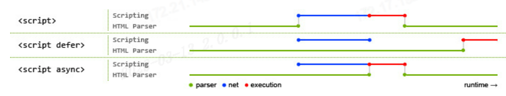

# <center>**html**</center>

<article align="left" padding="0 12px">

<style>
img[src*="#picwidth"]{
    width: 430px;
}
</style>

html中标识

### link-media 属性

针对两种不同的媒介类型（计算机屏幕和打印）的两种不同的样式表：
```html
<head>
<link rel="stylesheet" type="text/css" href="theme.css">
<link rel="stylesheet" type="text/css" href="print.css" media="print">
</head>
```
> 设备

```
<link media="value">
```


### script-defer/async 属性
```html
<!-- 浏览器立即加载并执行相应的脚本 -->
<script src="example.js"></script>
<!-- 文档的加载和渲染与js脚本的加载和执行是并行进行(异步执行) -->
<script async src="example.js"></script>
<!-- 加载后续文档的过程和js脚本的加载(此时仅加载不执行)是并行进行的(异步加载) ，js脚本的执行需要等到文档所有元素解析完成之后，DOMContentLoaded事件触发执行之前-->
<script defer src="example.js"></script>
```


浏览器工作原理（渲染页面）
https://developer.mozilla.org/zh-CN/docs/Web/Performance/How_browsers_work


</article>