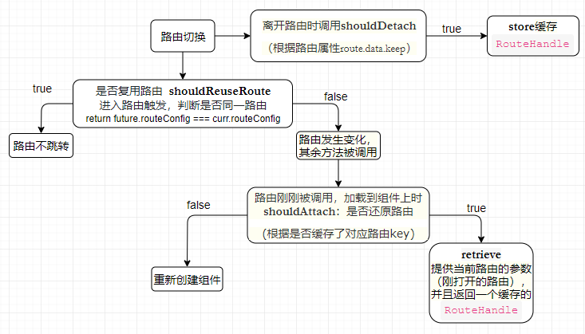

# <center>路由缓存</center>

### vue
keep-alive组件
原理：通过object缓存页签key和vnode

当缓存的数量超过max设置的数值时，keep-alive会移除key数组中的第一个元素
```ts
 render () {
    const slot = this.$slots.default; //获取默认插槽
    const vnode = getFirstComponentChild(slot); //得到插槽中第一个组件的vnode
    const name = getComponentName(vnode.componentOptions); //获取组件名字
   
    const { cache, keys } = this; //获取当前的混村内对象和key数组
    const key: ?string = vnode.key == null
        ? componentOptions.Ctor.cid + (componentOptions.tag ? `::${componentOptions.tag}` : '')
        : vnode.key; //获取组件的key值，如果没有key值，会按照规则自动生成
      if (cache[key]) {
      //有缓存
      //重用组件实例
        vnode.componentInstance = cache[key].componentInstance    
        remove(keys, key); //删除key值
        //将key值加入到数组末尾，这样是为了保证最近使用的组件在数组中靠后，主要是为了方便设置的max值删除很久没使用的组件
        keys.push(key)
      } else {
      //没有缓存的则进行缓存
        cache[key] = vnode
        keys.push(key)
        // prune oldest entry
        if (this.max && keys.length > parseInt(this.max)) {
        //超过最大缓存数量，移除第一个key对应的缓存
          pruneCacheEntry(cache, keys[0], keys, this._vnode)
        }
      }

      vnode.data.keepAlive = true
    }
    return vnode || (slot && slot[0])
  }
```

### angular
在组件切换的时候，angular都会销毁上一个组件，并且创建一个新的组件，有时我们并不想这样做，于是可以使用路由策略RouteReuseStrategy实现类似组件缓存的功能。

RouteReuseStrategy接口声明了5个方法:

* shouldReuseRoute
每次切换路由时都会被调用。future参数是将要离开的路由，curr参数是将要加载的路由。如果这个方法返回true，路由将不会跳转（意味着路由没有发生变化）。如果它返回false，则路由发生变化并且其余方法会被调用。
```ts
shouldReuseRoute(future: ActivatedRouteSnapshot, curr: ActivatedRouteSnapshot): boolean {
    // 默认行为
    return future.routeConfig === curr.routeConfig;
}
```
* shouldAttach
路由刚刚被打开，当我们加载到这个路由的组件上时，shouldAttach会被调用。一旦组件被加载这个方法都会被调用。如果这个方法返回true，retrieve方法将会被调用。否则这个组件将会被重新创建。
```ts
shouldAttach(route: ActivatedRouteSnapshot): boolean;
```
* retrieve
当shouldAttach方法返回true时这个方法会被调用。提供当前路由的参数（刚打开的路由），并且返回一个缓存的RouteHandle。如果返回null表示没有效果。我们可以使用这个方法手动获取任何已被缓存的RouteHandle。框架不会自动管理它，需要我们手动实现。
```ts
retrieve(route: ActivatedRouteSnapshot): DetachedRouteHandle | null;
```
* shouldDetach
当离开当前路由时这个方法会被调用。如果返回true，store方法会被调用。
```ts
shouldDetach(route: ActivatedRouteSnapshot): boolean;
```
* store
这个方法当且仅当shouldDetach方法返回true时被调用。我们可以在这里具体实现如何缓存RouteHandle。在这个方法中缓存的内容将会被用在retrieve方法中。它提供了我们离开的路由和RouteHandle。
```ts
store(route: ActivatedRouteSnapshot, detachedTree: DetachedRouteHandle): void;
```


写下service
```ts
import { RouteReuseStrategy, DetachedRouteHandle, ActivatedRouteSnapshot } from '@angular/router';
export class RouteStrategyService implements RouteReuseStrategy {
  public static handlers: { [key: string]: DetachedRouteHandle } = {};
  public static deleteRouteSnapshot(path: string): void {
    const name = path.replace(/\//g, '_');
    if (RouteStrategyService.handlers[name]) {
      delete RouteStrategyService.handlers[name];
    }
  }
  /**
   * 判断当前路由是否需要缓存
   * 这个方法返回false时则路由发生变化并且其余方法会被调用
   * @param {ActivatedRouteSnapshot} future
   * @param {ActivatedRouteSnapshot} curr
   * @returns {boolean}
   * @memberof CacheRouteReuseStrategy
   */
  public shouldReuseRoute(future: ActivatedRouteSnapshot, curr: ActivatedRouteSnapshot): boolean {
    return future.routeConfig === curr.routeConfig
      && JSON.stringify(future.params) === JSON.stringify(curr.params);
  }
  /**
   * 当离开当前路由时这个方法会被调用
   * 如果返回 true 则 store 方法会被调用
   * @param {ActivatedRouteSnapshot} route
   * @returns {boolean}
   * @memberof CacheRouteReuseStrategy
   */
  public shouldDetach(route: ActivatedRouteSnapshot): boolean {
       // 若是全缓存可去掉此分支
        if (!route.data.keep) {
            return false;
        }
        return true;
  }
  /**
   * 将路由写入缓存
   * 在这里具体实现如何缓存 RouteHandle
   * 提供了我们离开的路由和 RouteHandle
   * @param {ActivatedRouteSnapshot} route
   * @param {DetachedRouteHandle} detachedTree
   * @memberof CacheRouteReuseStrategy
   */
  public store(route: ActivatedRouteSnapshot, detachedTree: DetachedRouteHandle): void {
    RouteStrategyService.handlers[this.getPath(route)] = detachedTree;
    // TODO:如果超出了max数量做个删除操作
  }
  /**
   * 路由被导航 如果此方法返回 true 则触发 retrieve 方法
   * 如果返回 false 这个组件将会被重新创建
   * @param {ActivatedRouteSnapshot} route
   * @returns {boolean}
   * @memberof CacheRouteReuseStrategy
   */
  public shouldAttach(route: ActivatedRouteSnapshot): boolean {
    return !!RouteStrategyService.handlers[this.getPath(route)];
  }
  /**
   * 从缓存读取cached route
   * 提供当前路由的参数（刚打开的路由），并且返回一个缓存的 RouteHandle
   * 可以使用这个方法手动获取任何已被缓存的 RouteHandle
   * @param {ActivatedRouteSnapshot} route
   * @returns {(DetachedRouteHandle | null)}
   * @memberof CacheRouteReuseStrategy
   */
  public retrieve(route: ActivatedRouteSnapshot): DetachedRouteHandle | null {
    return RouteStrategyService.handlers[this.getPath(route)] || null;
  }
  private getPath(route: ActivatedRouteSnapshot): string {
    // tslint:disable-next-line: no-string-literal
    const path = route['_routerState'].url.replace(/\//g, '_');
    return path;
  }
}
```
在module中引入
```ts
providers: [
        ...
        { provide: RouteReuseStrategy, useClass: RouteStrategyService }
    ],
```
注意：
* 调用RouteStrategyService中的deleteRouteSnapshot方法删除已缓存的页面
* 有控制的设置路由和缓存数量避免内存泄漏

除了详情返回，页签切换也可以使用缓存
页签切换的缓存什么时候刷新？点搜索的时候刷新，切换时间的时候刷新

### react


