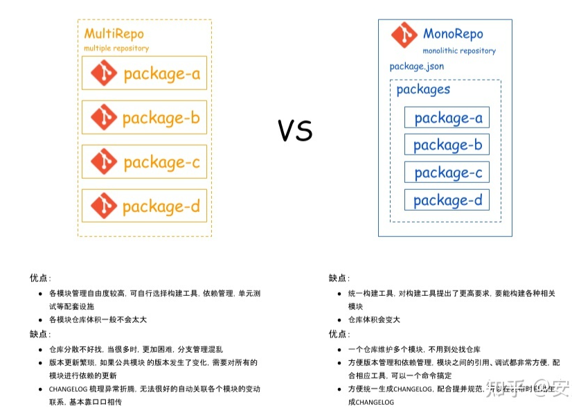
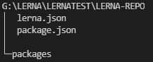
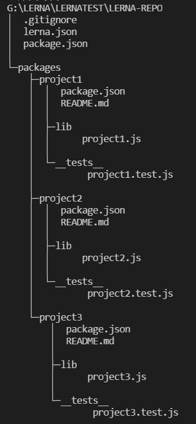
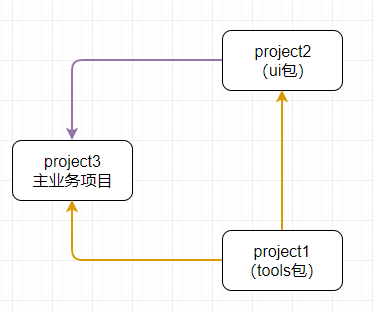
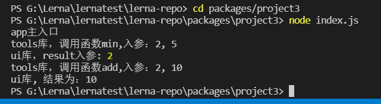
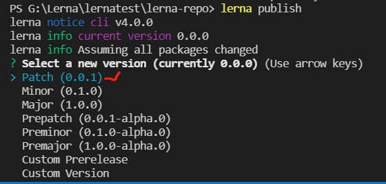
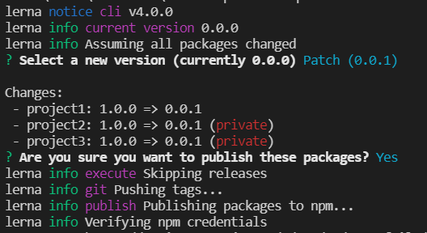

# <center>**lerna**</center>
<article align="left" padding="0 12px">

#### 背景
lerna作为Monorep管理工具，能方便的同时管理多个相互有依赖的项目模块。
[^引用]
[^引用]:https://zhuanlan.zhihu.com/p/404166248

框架类项目vue-cli、react-router、webpack-cli，工具类项目Babel、primer、typescript-eslint、Jest等，可视化项目grafana、antv-x6等都使用lerna来进行整体项目管理。

#### 优势
使用lerna进行多软件包代码仓库管理能优化工作流程，主要优势有以下三点：

1、多软件包相互依赖，依赖的软件包有变化，引用该软件包的其他仓库都能通过直接引用软连接自动响应变更，并且变化的软件包都能自动更新版本，无需人为维护版本号更替。
有两种模式选择：可以单独给每个依赖包发布版本号，也可以统一所有软件包依赖版本。

2、可提取多个项目公共依赖包

3、git提交改变，自动发布，自动生成变更日志

#### 使用步骤

那么lerna如何使用，看一下基本步骤介绍：

1. 全局安装lerna
```
npm install --global lerna
```

2. 初始化本地git项目lerna-repo，进入项目目录
```
git init lerna-repo && cd lerna-repo
```

3. 添加.gitignore文件
```
node_modules/
lerna-debug.log
npm-debug.log
packages/*/lib
```

4. 初始化lerna项目
lerna有两种工作模式：
* 统一模式Fixed/Locked mode (default)
> lerna init

vue,babel都是用这种，在发布时，所有的包版本都会更新，并且版本一致，版本号维护在 lerna.jon 的 version 中。


* 独立模式Independent mode
> lerna init --independent
允许使用者对每个package单独改变版本号。每次执行lerna publish的时候，针对所有有更新的package，会逐个询问需要升级的版本号，基准版本为它自身的package.json里面的版本号。

当使用统一模式时：
```
lerna init
```
此时项目目录如图：

packages文件夹下面是每个单独的项目包，有各自独立的package.json 文件

lerna.json是lerna 配置文件：
 ```json
 {
  "packages": [
    "packages/*"
  ],
  "version": "0.0.0"
}
 ```

5. 启用yarn workspaces
通过Workspaces设置，把所有项目依赖提升到顶层node_modules中，并且在node_modules中链接本地的package。
也就是说全部本地packages内的子项目都会链接到根目录的node_modules中。
**此项特性对项目依赖的项目特别重要**
```json
// package.json

"private": true,

"workspaces": [

    "packages/*"

],
 

// lerna.json

 
"useWorkspaces": true,

"npmClient": "yarn",
```

6. 进入packages，创建子项目目录
```
cd packages
mkdir project1 project2 project3

// 分别进入三个目录初始化
cd project1
npm init -y

cd project2
npm init -y

cd project3
npm init -y
```
此时项目结构如下：


7. 在指定子目录下创建包
```json
// 根目录的package.json中添加workspaces子项目
"workspaces": [
    "packages/*",
    "packages/project1/*"，
    "packages/project2/*"
    "packages/project3/*"
  ],

// 创建包放在指定文件夹下（如果没有指定文件夹默认放在workspaces[0]）
lerna create project1 packages/project1 -y
lerna create project2 packages/project2 -y
lerna create project3 packages/project3 -y
```
此时项目目录如下：

<!--  -->

8. 给项目添加依赖
假设：
project3为业务主项目，不需要发布npm包，需要依赖调用project2（ui包）和project1（tools工具包）
project2（ui包），不需要发布npm包，需要依赖project1（tools工具包）
project1（tools工具包），共享工具库，需要发布npm包

```
lerna add project1 --scope=project3     在project3下安装project1,project2
lerna add project2 --scope=project3     
lerna add project1 --scope=project2     在project2下安装project1
```

```javascript
// 工具库project1添加内容:index.js
function max(a, b) {
     console.log("tools库，调用函数min,入参：%d, %d",a ,b)
    return Math.max(a, b);
}
function min(a, b) {
    console.log("tools库，调用函数min,入参：%d, %d",a ,b)
    return Math.min(a, b);
}
 
module.exports = { max, min };

// ui库project2添加内容:index.js
const { max } = require('project1');
 
function ui(result) {
    console.log("ui库，result入参:", result);
    console.log("ui库, 结果为："+ max(result, 10));
}
 
module.exports = ui;


// 主业务项目project3添加内容:index.js
const { min } = require('project1');
const ui = require("project2");
 
function app() {
    console.log("app主入口");
    let minNum = min(2, 5);
    ui(minNum);
}
 
app();
```
执行业务项目结果：


9. 本地git项目与自己的远程git仓库关联
```
 git remote add origin git@github.com:your-git/name.git
```
确保提交**所有修改内容到git后**，查看是否登录
```
npm whoami
```
没有则登录
```
npm login
```

10. 打包发布，自动更新版本
```
lerna publish
```
选择默认发布版本号

选择版本号后可以看到各个包的版本号变更

可以看到三个packages的版本号都统一升级成了0.0.1，而且可以看到project2和project3展示为private，说明不会被发布到npm。

#### 总结

至此一个完整的lerna项目就创建完成，步骤演示了从初步搭建到提交仓库发布的完整过程，
如果新拉取一个lerna项目，首次需要通过lerna bootstrap安装所有依赖项并且链接所有内部交叉依赖，
通过lerna updated，lerna changed，lerna diff等可以看到变更引起的关联的组件的变更列表，相比人工维护版本依赖更新更加稳健。

lerna非常适用于项目依赖紧密的项目仓库中心，配合eslint规则检查，prettier自动格式化代码，提供一种集中自动化管理模式，在一个目录下便可以掌控全局，让开发者更专注内容的开发，更好的完成组件构建。

</article>