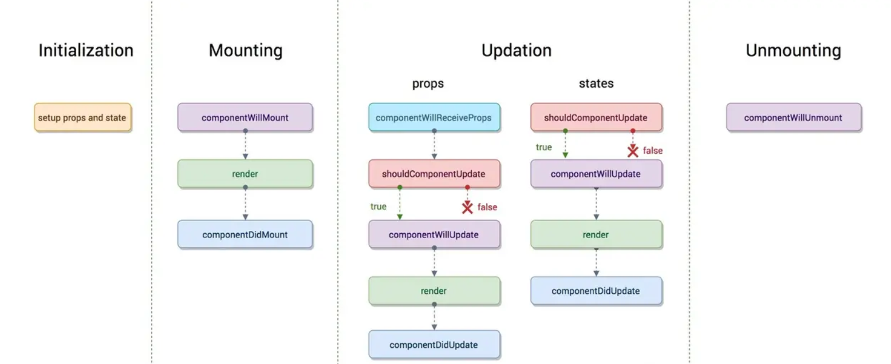
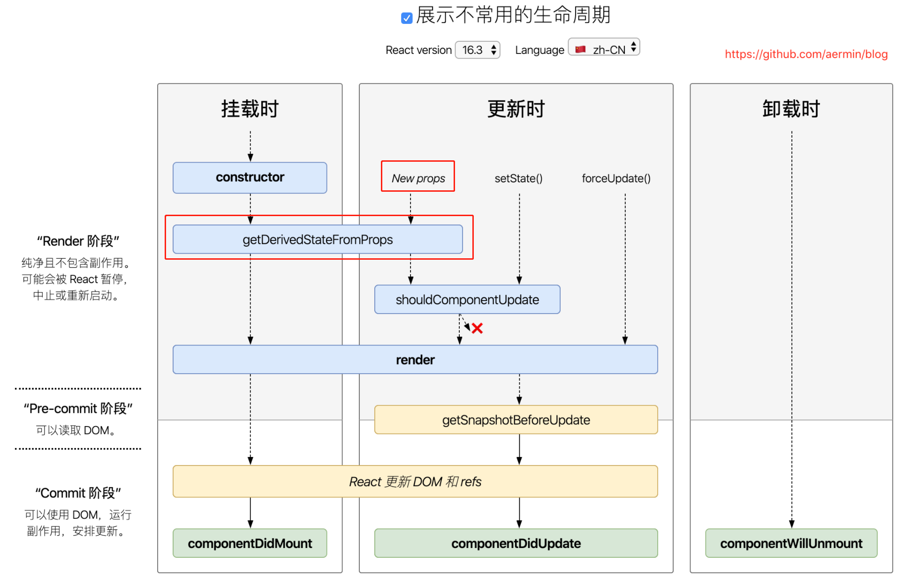
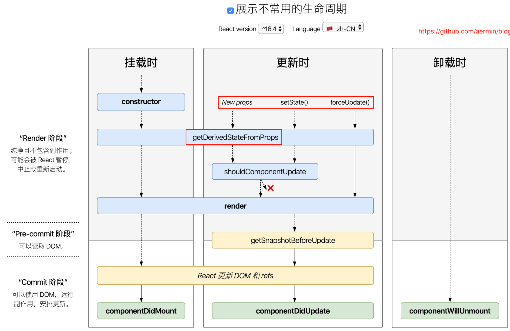

# <center>**React生命周期函数**</center>
<article align="left" padding="0 12px">

#### **React v16.4之前的生命周期**

 
生命周期图主要分为： 初始化阶段、挂载阶段、更新阶段、卸载阶段。

* **初始化(initialization)阶段**
>**constructor**
在constructor 中进行state、props的初始化，
这个阶段修改 state，不会执行更新阶段的生命周期，可以**直接对 state 赋值**。
父组件的props注入给子组件，功子组件读取(组件中**props只读不可变，state可变**)。

* **挂载阶段**
>**componentWillMount（弃）**
    发生在 render 函数之前，还**没有挂载 Dom**，**只会被调用一次（fiber后启用async render后可能会被调用多次）**，这边调用this.setState不会引起组件重新渲染，也可以把写在这边的内容提前到constructor()中，很少用。
**render**
**componentDidMount**
    发生在 render 函数之后，**已经挂载 Dom**，**只会被调用一次（fiber后启用async render后可能会被调用多次）**

* **更新阶段**
组件的重新render：
1、setState引起的state更新
2、父组件重新引起的props更新
>*props：*
    **componentWillReceiveProps(nextProps,nextState)（弃）**
        这个生命周期主要为我们提供对 **props 发生改变的监听**，如果你需要在 props 发生改变后，相应改变组件的一些 state。在这个方法中**改变 state 不会二次渲染**，而是直接合并 state**:**
        每次子组件接收到新的props，都会重新渲染一次，除非你做了处理来阻止（比如使用：shouldComponentUpdate），但是你可以在这次渲染前，根据新的props更新state，更新state也会触发一次重新渲染，但react不会这么傻，所以只会渲染一次，不会二次渲染。

a. 直接使用,每当父组件重新render导致的重传props，子组件将直接跟着重新渲染，无论props是否有变化。可通过shouldComponentUpdate方法优化。
```
class Child extends Component {
   shouldComponentUpdate(nextProps){ // 应该使用这个方法，否则无论props是否有变化都将会导致组件跟着重新渲染
        if(nextProps.someThings === this.props.someThings){
          return false
        }
    }
    render() {
        return <div>{this.props.someThings}</div>
    }
}
```
b.在componentWillReceiveProps方法中，将props转换成自己的state
```
    class Child extends Component {
        constructor(props) {
            super(props);
            this.state = {
                someThings: props.someThings
            };
        }
        componentWillReceiveProps(nextProps) { // 父组件重传props时就会调用这个方法
            // 这里面的this.state是上一次的状态
            this.setState({someThings: nextProps.someThings});
        }
        render() {
            return <div>{this.state.someThings}</div>
        }
    }
```
> **shouldComponentUpdate(nextProps,nextState)**
        这个生命周期需要返回一个 Boolean 类型的值，判断是否需要更新渲染组件，优化 react 应用的主要手段之一，当返回 false 就不会再向下执行生命周期了，在这个阶段**不可以 setState()**，会导致循环调用。

> **componentWillUpdate(nextProps,nextState)（弃）**
        这个生命周期主要是给我们一个时机能够处理一些在 Dom 发生更新之前的事情，如获得 Dom 更新前某些元素的坐标、大小等，在这个阶段**不可以 setState()**，会导致循环调用。
    **一直到这里 this.props 和 this.state 都还未发生更新**

> **render**
        执行 render 函数。(this.props 和 this.state发生了更新)
    **componentDidUpdate(prevProps, prevState)** 
        在此时已经完成渲染，Dom 已经发生变化，State 已经发生更新，prevProps、prevState 均为上一个状态的值。
**state（具体同上）**
    1. shouldComponentUpdate
    2. componentWillUpdate（**弃**）
    3. render
    4. componentDidUpdate

* **卸载阶段**
>**componentWillUnmount**
组件卸载及销毁之前直接调用。在此方法中执行必要的清理操作，例如:
1、清除 timer，
2、取消网络请求
3、清除在componentDidMount中创建的订阅等
componentWillUnmount 中**不应调用 setState**，因为该组件将永远不会重新渲染。组件实例卸载后，将永远不会再挂载它。

所谓的 setState 是“异步”的，并非 setState 函数插入了新的宏任务或微任务，而是在进行到 componentDidUpdate 这个生命周期之前，React 都不会更新组件实例的 state 值。


#### **React v16.4+ 的生命周期**

在**render函数之前的**除了shouldComponentUpdate外所有函数**componentWillMount，componentWillReceiveProps，componentWillUpdate**都被getDerivedStateFromProps替代。

强制开发者在render之前只做无副作用的操作，能做的操作局限在根据props和state决定新的state。

*中间React v16.3版本：*
getDerivedStateFromProps只在创建和更新（由父组件引发部分）中调用。如果不是由父组件引发，自身setState引发或者forceUpdate引发，getDerivedStateFromProps不会被调用。


*React v16.4+版本：*
**static getDerivedStateFromProps**无论是Mounting还是Updating（创建时和更新时的render方法之前），也无论是因为什么引起的Updating，全部都会被调用。
```
static getDerivedStateFromProps(nextProps, prevState) {
  //根据nextProps和prevState计算出预期的状态改变，返回结果会被送给setState
}
```
*函数里面的this为undefined：*
static静态方法只能Class(构造函数)来调用(App.staticMethod✅)，而实例是不能的( (new App()).staticMethod ❌ )；
当调用React Class组件时，该组件会实例化；
所以，React Class组件中，静态方法getDerivedStateFromProps无权访问Class实例的this，即this为undefined。


**getSnapshotBeforeUpdate**
被调用于render之后，可以读取但无法使用DOM的时候。它使您的组件可以在可能更改之前从DOM捕获一些信息（例如滚动位置）。此生命周期返回的任何值都将作为参数传递给componentDidUpdate（）。
```
class ScrollingList extends React.Component {
  constructor(props) {
    super(props);
    this.listRef = React.createRef();
  }

  getSnapshotBeforeUpdate(prevProps, prevState) {
    //我们是否要添加新的 items 到列表?
    // 捕捉滚动位置，以便我们可以稍后调整滚动.
    if (prevProps.list.length < this.props.list.length) {
      const list = this.listRef.current;
      return list.scrollHeight - list.scrollTop;
    }
    return null;
  }

  componentDidUpdate(prevProps, prevState, snapshot) {
    //如果我们有snapshot值, 我们已经添加了 新的items.
    // 调整滚动以至于这些新的items 不会将旧items推出视图。
    // (这边的snapshot是 getSnapshotBeforeUpdate方法的返回值)
    if (snapshot !== null) {
      const list = this.listRef.current;
      list.scrollTop = list.scrollHeight - snapshot;
    }
  }

  render() {
    return (
      <div ref={this.listRef}>{/* ...contents... */}</div>
    );
  }
}
```
详细场景：

```

<script type = 'text/babel'>
 
class SnapshotSample extends React.Component {
     constructor(props) {
        super(props);
        this.state = {
          messages: [],//用于保存子div
        }
     }
 
     handleMessage () {//用于增加msg
       this.setState( pre => ({
         messages: [`msg: ${ pre.messages.length }`, ...pre.messages],
       }))
     }
     componentDidMount () {
        
       for (let i = 0; i < 20; i++) this.handleMessage();//初始化20条
       this.timeID = window.setInterval( () => {//设置定时器
            if (this.state.messages.length > 200 ) {//大于200条，终止
              window.clearInterval(this.timeID);
              return ;
            } else {
              this.handleMessage();
            }
       }, 1000)
     }
     componentWillUnmount () {//清除定时器
       window.clearInterval(this.timeID);
     }
     getSnapshotBeforeUpdate () {//很关键的，我们获取当前rootNode的scrollHeight，传到componentDidUpdate 的参数perScrollHeight
       return this.rootNode.scrollHeight;
     }
     componentDidUpdate (perProps, perState, perScrollHeight) {
       const curScrollTop= this.rootNode.scrollTop;
       if (curScrollTop < 5) return ;
       this.rootNode.scrollTop = curScrollTop + (this.rootNode.scrollHeight  - perScrollHeight);
       //加上增加的div高度，就相当于不动
     }
     render () {
      
       return (
           <div className = 'wrap'  ref = { node => (  this.rootNode = node)} >
               { this.state.messages.map( msg => (
                 <div>{ msg } </div>
               ))}
          </div>
       );
     }
}
ReactDOM.render(
  <SnapshotSample />,
  document.getElementById("root")
)
</script>
<style type="text/css">
.wrap{
    height: 100px;
    width :200px;
    padding: 1px solid #eee;
    overflow:auto;
}
</style>

```

代替componentWillUpdate。
常见的 componentWillUpdate 的用例是在组件更新前，读取当前某个 DOM 元素的状态，并在 componentDidUpdate 中进行相应的处理。
这两者的区别在于：

在 React 开启异步渲染模式后，在 render 阶段读取到的 DOM 元素状态并不总是和 commit 阶段相同，这就导致在
componentDidUpdate 中使用 componentWillUpdate 中读取到的 DOM 元素状态是不安全的，因为这时的值很有可能已经失效了。
getSnapshotBeforeUpdate 会在最终的 render 之前被调用，也就是说在 getSnapshotBeforeUpdate 中读取到的 DOM 元素状态是可以保证与 componentDidUpdate 中一致的。
此生命周期返回的任何值都将作为参数传递给componentDidUpdate（）。

</article>