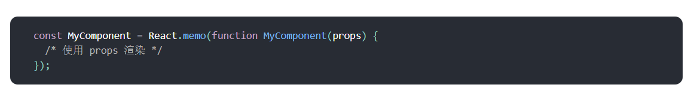
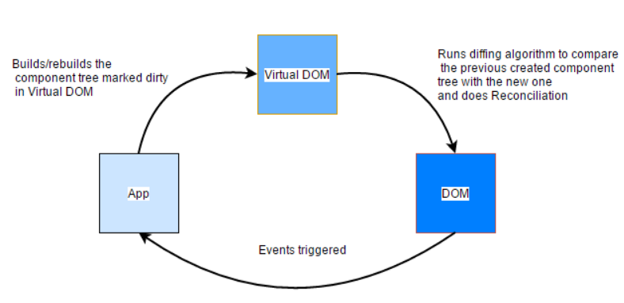
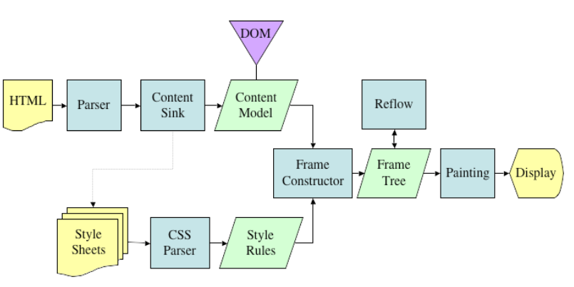

# 
**react渲染原理**

<article align="left" padding="0 12px">

### 一、从官方性能优化四个要点谈到虚拟dom：
https://zh-hans.reactjs.org/docs/optimizing-performance.html

**1. 压缩版本**

**2. 虚拟列表**

**3. shouldComponentUpdate**（默认返回true)，**返回false，不更新**
——>React.PureComponent(props 和 state 的**浅**比较：复杂对象变更不更新->也可通过component.forceUpdate()强制调用render)
React.PureComponent 中的 shouldComponentUpdate() return false将跳过所有子组件树的 prop 更新。

>dom操作相对于js对象操作更慢，通过js对象表示虚拟dom进行diff对比后统一修改真实dom
组件props或state变更，react会将最新返回的元素vdom和之前渲染的元素vdom对比，决定是否更新真实dom。
即使只更新改变了的dom节点，重新渲染也要时间，所以还可以通过shouldComponentUpdate 来进行提速

**4. 不可变数据immutable**

复杂对象的变更——触发render更新的方式：
通过方法：array.concat([])、Object.assign({}, colormap, {right: 'blue'})
或者扩展运算符：[...array,[]],{...colormap, right: 'blue'}

React.memo

在相同**props**的情况下渲染相同的结果,用React.memo包裹：通过记忆组件渲染结果的方式来提高组件的性能

areEqual返回false说明props前后不相等，重新渲染

#### Diff算法
https://zh-hans.reactjs.org/docs/reconciliation.html

Diff算法：对比props或state变化前后返回的两颗React元素树之间的差别，生成将一棵树转换成另一棵树的最小操作次数的算法叫Diff算法，通过Diff算法高效实现UI更新

react的Diff算法设计原则
1. 两个不同类型的元素会产生出不同的树；
2. 开发者可以通过设置 key 属性，来告知渲染哪些子元素在不同的渲染下可以保存不变；

### 二、React 中的 Virtual-DOM 和 diffing 是如何工作的
https://medium.com/@gethylgeorge/how-virtual-dom-and-diffing-works-in-react-6fc805f9f84e

>树形结构的dom，每次变化后，它的子元素都必经过重排（Reflow/Layout）+重绘（painting），这会导致跟新变慢。
>Virtual-DOM 所做的是，它试图最小化这两个阶段，从而为大型复杂应用程序获得更好的性能。

</article>