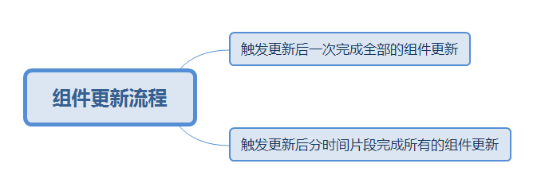

# <center>**react渲染原理**</center>
<article align="left" padding="0 12px">
<style>
img[src*="#firstimg"]{
    width: 540px;
}
</style>

### 一、从官方性能优化四个要点谈到虚拟dom：
https://zh-hans.reactjs.org/docs/optimizing-performance.html

**1. 压缩版本**

**2. 虚拟列表**

**3. shouldComponentUpdate**（默认返回true)，**返回false，不更新**
——>React.PureComponent(props 和 state 的**浅**比较：复杂对象变更不更新->也可通过component.forceUpdate()强制调用render)
React.PureComponent 中的 shouldComponentUpdate() return false将跳过所有子组件树的 prop 更新。


>dom操作相对于js对象操作更慢，通过js对象表示虚拟dom进行diff对比后统一修改真实dom
组件props或state变更，react会将最新返回的元素vdom和之前渲染的元素vdom对比，决定是否更新真实dom。
即使只更新改变了的dom节点，重新渲染也要时间，所以还可以通过shouldComponentUpdate 来进行提速

**4. 不可变数据immutable**

复杂对象的变更——触发render更新的方式：
通过方法：array.concat([])、Object.assign({}, colormap, {right: 'blue'})
或者扩展运算符：[...array,[]],{...colormap, right: 'blue'}

React.memo


在相同**props**的情况下渲染相同的结果,用React.memo包裹：通过记忆组件渲染结果的方式来提高组件的性能

areEqual返回false说明props前后不相等，重新渲染

#### Diff算法
https://zh-hans.reactjs.org/docs/reconciliation.html

Diff算法：对比props或state变化前后返回的两颗React元素树之间的差别，生成将一棵树转换成另一棵树的最小操作次数的算法叫Diff算法，通过Diff算法高效实现UI更新

react的Diff算法设计原则
1. 两个不同类型的元素会产生出不同的树；
2. 开发者可以通过设置 key 属性，来告知渲染哪些子元素在不同的渲染下可以保存不变；

### 二、React 中的 Virtual-DOM 和 diffing 是如何工作的
https://medium.com/@gethylgeorge/how-virtual-dom-and-diffing-works-in-react-6fc805f9f84e


>树形结构的dom，每次变化后，它的子元素都必经过重排（Reflow/Layout）+重绘（painting），这会导致跟新变慢。
>Virtual-DOM 所做的是，它试图最小化这两个阶段，从而为大型复杂应用程序获得更好的性能。


## React原理解析
https://yuchengkai.cn/react/2019-08-05.html#%E8%BF%99%E7%AF%87%E6%96%87%E7%AB%A0%E4%BD%A0%E8%83%BD%E5%AD%A6%E5%88%B0%E4%BB%80%E4%B9%88%EF%BC%9F
### 组件更新
组件跟新流程
#### setState如何批量更新
```js
handleClick () {
  // 初始化 `count` 为 0
  console.log(this.state.count) // -> 0
  this.setState({ count: this.state.count + 1 })
  this.setState({ count: this.state.count + 1 })
  console.log(this.state.count) // -> 0
  this.setState({ count: this.state.count + 1 })
  console.log(this.state.count) // -> 0
}

isBatchingUpdates = true
try {
  handleClick()
} finally {
  isBatchingUpdates = false
  // 然后去更新
}
```
虽然在 handleClick 中调用了三次 setState，但是并不会走完三次的组件更新流程，
只是把更新状态的逻辑丢到了一个队列中。
当 handleClick 执行完毕之后会执行一次组件更新的流程。




#### Fiber
上图中第一种方式一次性更新组件是React15收的组件更新方式，如果组件庞大，整个更新过程较长，阻塞主线程，会造成交互动画更新卡顿。

组件跟新——>持续调用函数——>虚拟调用栈

Fiber将整个跟新任务拆分为一个个小的任务，并且控制任务的执行，其实现主要技术：
* 新的数据结构fiber
* 调度器

##### 新的数据结构fiber
拆分更新任务的粒度——>fiber
把每个fiber认为是一个工作单元，执行更新任务的整个流程（不包括渲染）就是在反复寻找工作单元并运行它们，这样的方式就实现了拆分任务的功能。

拆分成工作单元的目的就是为了让我们能控制 stack frame（调用栈中的内容），可以随时随地去执行它们。由此使得我们在每运行一个工作单元后都可以按情况继续执行或者中断工作（中断的决定权在于调度算法）。

fiber 这个数据结构？
fiber 内部其实存储了很多上下文信息，我们可以把它认为是改进版的虚拟 DOM，它同样也对应了组件实例及 DOM 元素。同时 fiber 也会组成 fiber tree，但是它的结构不再是一个树形，而是一个链表的结构。

```js
{
  ...
  // 浏览器环境下指 DOM 节点
  stateNode: any,

  // 形成列表结构
  return: Fiber | null,
  child: Fiber | null,
  sibling: Fiber | null,

  // 更新相关
  pendingProps: any,  // 新的 props
  memoizedProps: any,  // 旧的 props
  // 存储 setState 中的第一个参数
  updateQueue: UpdateQueue<any> | null,
  memoizedState: any, // 旧的 state

  // 调度相关
  expirationTime: ExpirationTime,  // 任务过期时间

  // 大部分情况下每个 fiber 都有一个替身 fiber
  // 在更新过程中，所有的操作都会在替身上完成，当渲染完成后，
  // 替身会代替本身
  alternate: Fiber | null,

  // 先简单认为是更新 DOM 相关的内容
  effectTag: SideEffectTag, // 指这个节点需要进行的 DOM 操作
  // 以下三个属性也会形成一个链表
  nextEffect: Fiber | null, // 下一个需要进行 DOM 操作的节点
  firstEffect: Fiber | null, // 第一个需要进行 DOM 操作的节点
  lastEffect: Fiber | null, // 最后一个需要进行 DOM 操作的节点，同时也可用于恢复任务
  ....
}
```
总的来说，我们可以认为 fiber 就是一个工作单元的数据结构表现，当然它同样也是调用栈中的一个重要组成部分。
> Fiber 和 fiber 不是同一个概念。前者代表新的调和器，后者代表 fiber node，也可以认为是改进后的虚拟 DOM。
##### 调度器
每次有新的更新任务发生的时候，调度器都会按照策略给这些任务分配一个优先级。比如说动画的更新优先级会高点，离屏元素的更新优先级会低点。


#### 调度任务


### Diff策略
#### 调和过程
组件更新（DOM更新）两个阶段：
1、调和阶段，diff算法
2、提交阶段，diff出来的内容提现到DOM
先解释一下调和阶段
```ts
class Test extends React.Component {
  state = {
    data: [{ key: 1, value: 1 }, { key: 2, value: 2 }]
  };
  componentDidMount() {
    setTimeout(() => {
      const data = [{ key: 0, value: 0 }, { key: 2, value: 2 }]
      this.setState({
        data
      })
    }, 3000);
  }
  render() {
    const { data } = this.state;
    return (
      <>
        { data.map(item => <p key={item.key}>{item.value}</p>) }
      </>
    )
  }
}
```


</article>