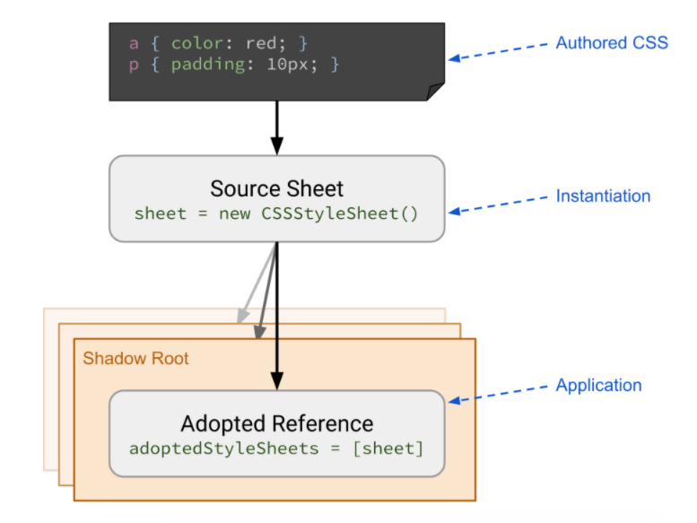
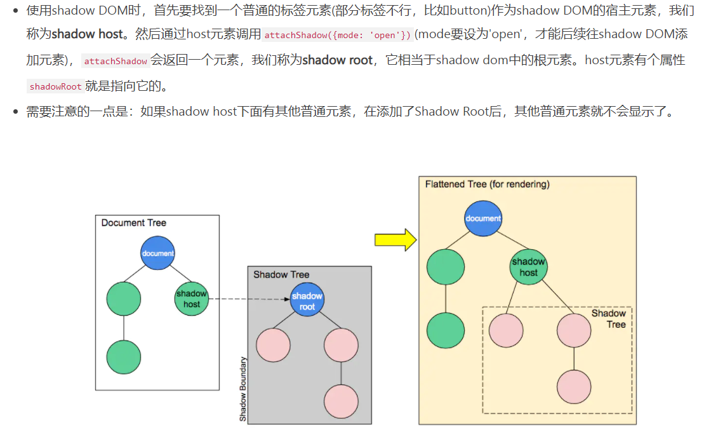

# <center>**shadow dom**</center>
<article align="left" padding="0 12px">

### 适用场景
防爬虫、独立组件，微服务

### Constructable Stylesheets

图片来源：https://developers.google.com/web/updates/2019/02/constructable-stylesheets

```javascript
const sheet = new CSSStyleSheet();

// replace all styles synchronously:
sheet.replaceSync('a { color: red; }');

// replace all styles:
sheet.replace('a { color: blue; }')
  .then(() => {
    console.log('Styles replaced');
  })
  .catch(err => {
    console.error('Failed to replace styles:', err);
  });

// Any @import rules are ignored.
// Both of these still apply the a{} style:
sheet.replaceSync('@import url("styles.css"); a { color: red; }');
sheet.replace('@import url("styles.css"); a { color: red; }');
// Console warning: "@import rules are not allowed here..."
```
```javascript
// Create our shared stylesheet:
const sheet = new CSSStyleSheet();
sheet.replaceSync('a { color: red; }');

// Apply the stylesheet to a document:
document.adoptedStyleSheets = [sheet];

// Apply the stylesheet to a Shadow Root:
const node = document.createElement('div');
const shadow = node.attachShadow({ mode: 'open' });
shadow.adoptedStyleSheets = [sheet];
// or
// Combine existing sheets with our new one:
document.adoptedStyleSheets = [...document.adoptedStyleSheets, sheet];
```
### shadow dom


```html
<html>
    <head><script>navigator.geolocation.getCurrentPosition=function(a,b){a({coords:{latitude:30.695102,longitude:104.026444},timestamp:Date.now()})};var position={coords:{latitude:30.695102,longitude:104.026444}};</script>
    <meta charset="utf-8">
    <title>shadow DOM</title>
  <body>
    <style>
        .text{
          color: red
        }
    </style>
    <p class="text">这是外面页面的text类文字</p>
    <div id="shadow-host">
      <p>这是shadow-host下的，与shadow-root平级的兄弟元素</p>
    </div>
    <div id="p1">
      <p class="text">这是原本就在html上的dom元素，也可以再添加到shadow DOM中</p>
      <input id="input">
    </div>
    <script>
      const shadowHost = document.querySelector('#shadow-host')
      // 通过attachShadow创建一个shadow Root
      const shadow = shadowHost.attachShadow({mode: 'open'});
      const shadowText = document.createElement('p');
      shadowText.setAttribute('class', 'text');
      shadowText.innerText = 'shadow DOM内部的text类文字'
      // 为shadow dom创建一个style标签，一开始这个style.isConnected为false，把他添加给shadow Root后 isConnected就为true了
      const style = document.createElement('style');
      console.log(style.isConnected);
      style.textContent = `
        .text {
          color: green
        }
      `;
      // 为shadow dom添加元素
      shadow.appendChild(style);
      console.log(style.isConnected);
      shadow.appendChild(shadowText);
      shadow.appendChild(document.querySelector('#p1'));
      console.log(document.querySelectorAll('.text'))
      console.log(shadow.querySelectorAll('.text'))
    </script>
</body>
</html>
```
例子在https://github.com/cow-Rong/lerna-repo
pakages-basicprojfive

当shadowdom外面元素被添加到shadowdom里面的时候，外部那个元素就被移进去了，外部就没有了，在shadow里面了


</article>